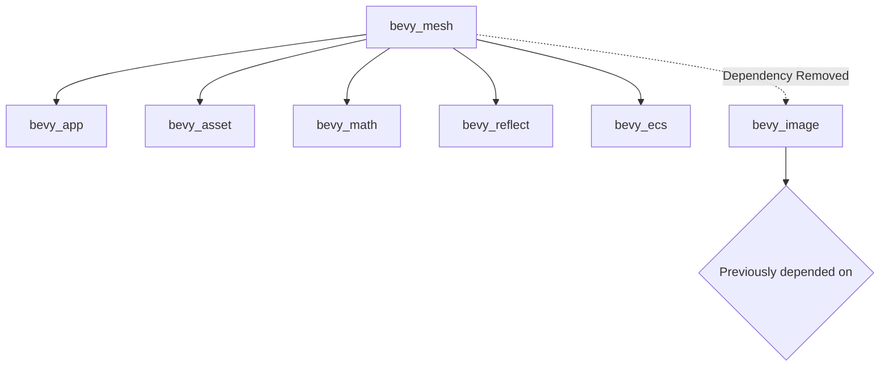

+++
title = "#23214 remove bevy_mesh dependency on bevy_image"
date = "2026-03-04T00:00:00"
draft = false
template = "pull_request_page.html"
in_search_index = true

[taxonomies]
list_display = ["show"]

[extra]
current_language = "en"
available_languages = {"en" = { name = "English", url = "/pull_request/bevy/2026-03/pr-23214-en-20260304" }, "zh-cn" = { name = "中文", url = "/pull_request/bevy/2026-03/pr-23214-zh-cn-20260304" }}
labels = ["D-Trivial"]
+++

# Title
remove bevy_mesh dependency on bevy_image

## Basic Information
- **Title**: remove bevy_mesh dependency on bevy_image
- **PR Link**: https://github.com/bevyengine/bevy/pull/23214
- **Author**: atlv24
- **Status**: MERGED
- **Labels**: D-Trivial, S-Ready-For-Final-Review
- **Created**: 2026-03-04T06:53:06Z
- **Merged**: 2026-03-04T08:08:30Z
- **Merged By**: mockersf

## Description Translation
# Objective

- yay

## Solution

- yeet

## Testing

- ci

## The Story of This Pull Request

This PR addresses a straightforward dependency cleanup in the Bevy engine's mesh system. The core issue was that the `bevy_mesh` crate had an optional dependency on `bevy_image` that wasn't actually required for its functionality. This created unnecessary coupling between modules and could lead to increased compilation times when features were enabled.

The problem became evident when examining the `Cargo.toml` file for `bevy_mesh`. The `bevy_image` dependency was marked as optional and only used by the `morph` feature. However, upon closer inspection, the mesh system didn't actually need the image crate for morph target functionality - it only needed the `glam/encase` feature for mathematical operations and serialization.

The developer approached this with a minimal change strategy: remove the dependency entirely and update any documentation that referenced it. In the `mesh.rs` file, there was a doc comment that referenced `bevy_image::ImageAddressMode`. Since the dependency was being removed, this documentation link needed to be updated to point to external documentation rather than an internal type reference.

The implementation involved two simple changes. First, in `Cargo.toml`, the `bevy_image` dependency declaration was completely removed from the dependencies section, and the `morph` feature was updated to no longer require it. Second, in `mesh.rs`, the documentation link was changed from a Rust doc intra-link to an external URL pointing to the docs.rs documentation for `bevy_image`.

This change follows good dependency management practices by eliminating unnecessary coupling between modules. When a crate only needs documentation references to another crate's types but doesn't actually use any of its code at compile time, it's better to remove the dependency and use external documentation links instead.

The impact of this change is primarily on build times and dependency graph cleanliness. Projects using the `morph` feature will no longer pull in the entire `bevy_image` crate and its dependencies, which reduces compilation overhead. It also makes the dependency graph easier to understand and maintain.

From an architectural perspective, this change reinforces the principle of minimal dependencies in Rust crate design. Each crate should only depend on what it actually needs to compile and run, not on what it might reference in documentation. This approach helps keep the codebase modular and maintainable over time.

## Visual Representation



## Key Files Changed

1. **`crates/bevy_mesh/Cargo.toml`**
   
   This file had two changes: removing the `bevy_image` dependency declaration and updating the `morph` feature to no longer require it.

   ```toml
   # Before:
   bevy_image = { path = "../bevy_image", version = "0.19.0-dev", optional = true }
   
   # ...later in the features section...
   morph = ["dep:bevy_image", "glam/encase"]
   
   # After:
   # bevy_image dependency completely removed
   
   # ...later in the features section...
   morph = ["glam/encase"]
   ```

   The removal eliminates an unnecessary compile-time dependency that was only referenced in documentation.

2. **`crates/bevy_mesh/src/mesh.rs`**

   This file had a single documentation link change to point to external documentation instead of an internal type reference.

   ```rust
   // Before:
   /// see [`ImageAddressMode`](bevy_image::ImageAddressMode).
   
   // After:
   /// see [`ImageAddressMode`](https://docs.rs/bevy_image/latest/bevy_image/enum.ImageAddressMode.html).
   ```

   This change maintains the documentation's usefulness while removing the compile-time dependency on `bevy_image`.

## Further Reading

- [Cargo Features Documentation](https://doc.rust-lang.org/cargo/reference/features.html) - Understanding how to properly manage optional dependencies in Rust
- [Rust Documentation Comments](https://doc.rust-lang.org/rustdoc/how-to-write-documentation.html) - Best practices for writing documentation with links
- [Bevy Engine Architecture](https://bevyengine.org/learn/book/getting-started/ecs/) - Understanding Bevy's modular architecture
- [Dependency Management in Rust](https://doc.rust-lang.org/cargo/guide/dependencies.html) - How to effectively manage crate dependencies

# Full Code Diff
```
diff --git a/crates/bevy_mesh/Cargo.toml b/crates/bevy_mesh/Cargo.toml
index 54f02095622c9..1cc4f112e1a16 100644
--- a/crates/bevy_mesh/Cargo.toml
+++ b/crates/bevy_mesh/Cargo.toml
@@ -13,7 +13,6 @@ keywords = ["bevy"]
 bevy_app = { path = "../bevy_app", version = "0.19.0-dev" }
 bevy_asset = { path = "../bevy_asset", version = "0.19.0-dev" }
 bevy_encase_derive = { path = "../bevy_encase_derive", version = "0.19.0-dev" }
-bevy_image = { path = "../bevy_image", version = "0.19.0-dev", optional = true }
 bevy_math = { path = "../bevy_math", version = "0.19.0-dev" }
 bevy_reflect = { path = "../bevy_reflect", version = "0.19.0-dev" }
 bevy_ecs = { path = "../bevy_ecs", version = "0.19.0-dev" }
@@ -47,7 +46,7 @@ serde_json = "1.0.140"
 default = []
 ## Adds serialization support through `serde`.
 serialize = ["dep:serde", "wgpu-types/serde"]
-morph = ["dep:bevy_image", "glam/encase"]
+morph = ["glam/encase"]
 
 [lints]
 workspace = true
diff --git a/crates/bevy_mesh/src/mesh.rs b/crates/bevy_mesh/src/mesh.rs
index e1288968dc9c6..5d12dac46822c 100644
--- a/crates/bevy_mesh/src/mesh.rs
+++ b/crates/bevy_mesh/src/mesh.rs
@@ -286,7 +286,7 @@ impl Mesh {
     /// one color, for example a logo, and you want to "extend" those borders.
     ///
     /// For different mapping outside of `0..=1` range,
-    /// see [`ImageAddressMode`](bevy_image::ImageAddressMode).
+    /// see [`ImageAddressMode`](https://docs.rs/bevy_image/latest/bevy_image/enum.ImageAddressMode.html).
     ///
     /// The format of this attribute is [`VertexFormat::Float32x2`].
     pub const ATTRIBUTE_UV_0: MeshVertexAttribute =
```