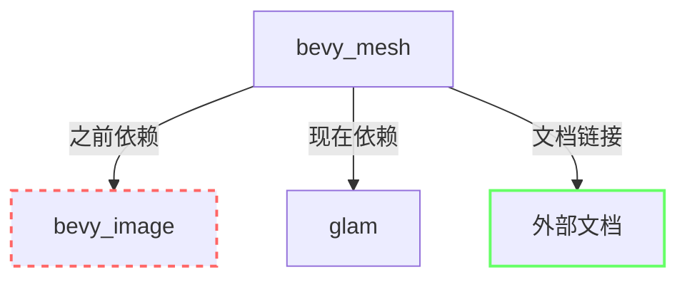

+++
title = "#23214 remove bevy_mesh dependency on bevy_image"
date = "2026-03-04T00:00:00"
draft = false
template = "pull_request_page.html"
in_search_index = false

[extra]
current_language = "zh-cn"
available_languages = {"en" = { name = "English", url = "/pull_request/bevy/2026-03/pr-23214-en-20260304" }, "zh-cn" = { name = "中文", url = "/pull_request/bevy/2026-03/pr-23214-zh-cn-20260304" }}
+++

# 移除 bevy_mesh 对 bevy_image 的依赖

## 基本信息
- **标题**: remove bevy_mesh dependency on bevy_image
- **PR链接**: https://github.com/bevyengine/bevy/pull/23214
- **作者**: atlv24
- **状态**: 已合并
- **标签**: D-Trivial, S-Ready-For-Final-Review
- **创建时间**: 2026-03-04T06:53:06Z
- **合并时间**: 2026-03-04T08:08:30Z
- **合并者**: mockersf

## 描述翻译
# 目标
- 好耶

## 解决方案
- 移除

## 测试
- CI

## 这个PR的故事

这个PR的核心目标很简单：移除`bevy_mesh`模块对`bevy_image`模块的依赖。这种类型的代码清理在大型代码库中很常见，目的是减少模块之间的耦合度，优化编译时间，并提高代码的模块化程度。

从技术角度看，这个修改主要涉及两个方面。首先，在`Cargo.toml`文件中，`bevy_mesh`原本有一个可选的`bevy_image`依赖项，这个依赖项只在`morph`特性启用时才需要。通过分析依赖关系，作者发现这个依赖实际上是不必要的，因此决定将其移除。

其次，在`mesh.rs`文件中，有一个文档注释引用了`bevy_image::ImageAddressMode`类型。当移除依赖后，这个引用就失效了。作者没有直接删除这个有用的文档，而是将其改为指向在线文档的链接，这样既保持了文档的完整性，又避免了编译时的依赖问题。

这种修改方式体现了软件工程中的一个重要原则：最小化依赖。当一个模块的功能不需要另一个模块时，就应该移除这个依赖。这不仅能减少编译时间（特别是对于像Bevy这样的大型Rust项目），还能让代码更容易理解和维护。

在实际操作中，作者做了两处修改：

1. 从`Cargo.toml`中移除了`bevy_image`依赖项，并更新了`morph`特性的定义
2. 将文档注释中的内部引用改为外部链接

这种修改虽然简单，但对代码库的健康度有积极影响。它减少了不必要的编译单元，使得`bevy_mesh`模块更加独立。对于使用`bevy_mesh`但不使用`bevy_image`的开发者来说，这意味着更快的编译速度和更少的内存使用。

从工程实践的角度看，这个PR也展示了如何正确处理文档引用。当移除一个模块依赖时，不能简单地删除所有相关引用，而需要考虑如何保持文档的可用性。将内部引用改为外部文档链接是一个实用的解决方案。

## 视觉表示



## 主要文件变更

### `crates/bevy_mesh/Cargo.toml` (+1/-2)

这个文件的变化移除了对`bevy_image`的依赖，并相应更新了特性定义。

**变更详情：**
```toml
# 之前：
bevy_image = { path = "../bevy_image", version = "0.19.0-dev", optional = true }

# 之后：
# bevy_image 依赖项被完全移除

# 之前morph特性的定义：
morph = ["dep:bevy_image", "glam/encase"]

# 之后morph特性的定义：
morph = ["glam/encase"]
```

### `crates/bevy_mesh/src/mesh.rs` (+1/-1)

这个文件中的变更更新了一个文档注释，将内部类型引用改为外部文档链接。

**变更详情：**
```rust
// 之前：
// see [`ImageAddressMode`](bevy_image::ImageAddressMode).

// 之后：
// see [`ImageAddressMode`](https://docs.rs/bevy_image/latest/bevy_image/enum.ImageAddressMode.html).
```

## 进一步阅读

1. [Cargo特性文档](https://doc.rust-lang.org/cargo/reference/features.html) - 了解Rust中特性系统的详细工作方式
2. [Bevy模块系统](https://bevyengine.org/learn/book/next/programming/ecs/) - 了解Bevy的模块化架构设计
3. [Rust编译优化](https://nnethercote.github.io/perf-book/compile-times.html) - 了解如何优化Rust项目的编译时间

# 完整代码差异
diff --git a/crates/bevy_mesh/Cargo.toml b/crates/bevy_mesh/Cargo.toml
index 54f02095622c9..1cc4f112e1a16 100644
--- a/crates/bevy_mesh/Cargo.toml
+++ b/crates/bevy_mesh/Cargo.toml
@@ -13,7 +13,6 @@ keywords = ["bevy"]
 bevy_app = { path = "../bevy_app", version = "0.19.0-dev" }
 bevy_asset = { path = "../bevy_asset", version = "0.19.0-dev" }
 bevy_encase_derive = { path = "../bevy_encase_derive", version = "0.19.0-dev" }
-bevy_image = { path = "../bevy_image", version = "0.19.0-dev", optional = true }
 bevy_math = { path = "../bevy_math", version = "0.19.0-dev" }
 bevy_reflect = { path = "../bevy_reflect", version = "0.19.0-dev" }
 bevy_ecs = { path = "../bevy_ecs", version = "0.19.0-dev" }
@@ -47,7 +46,7 @@ serde_json = "1.0.140"
 default = []
 ## Adds serialization support through `serde`.
 serialize = ["dep:serde", "wgpu-types/serde"]
-morph = ["dep:bevy_image", "glam/encase"]
+morph = ["glam/encase"]
 
 [lints]
 workspace = true
diff --git a/crates/bevy_mesh/src/mesh.rs b/crates/bevy_mesh/src/mesh.rs
index e1288968dc9c6..5d12dac46822c 100644
--- a/crates/bevy_mesh/src/mesh.rs
+++ b/crates/bevy_mesh/src/mesh.rs
@@ -286,7 +286,7 @@ impl Mesh {
     /// one color, for example a logo, and you want to "extend" those borders.
     ///
     /// For different mapping outside of `0..=1` range,
-    /// see [`ImageAddressMode`](bevy_image::ImageAddressMode).
+    /// see [`ImageAddressMode`](https://docs.rs/bevy_image/latest/bevy_image/enum.ImageAddressMode.html).
     ///
     /// The format of this attribute is [`VertexFormat::Float32x2`].
     pub const ATTRIBUTE_UV_0: MeshVertexAttribute =