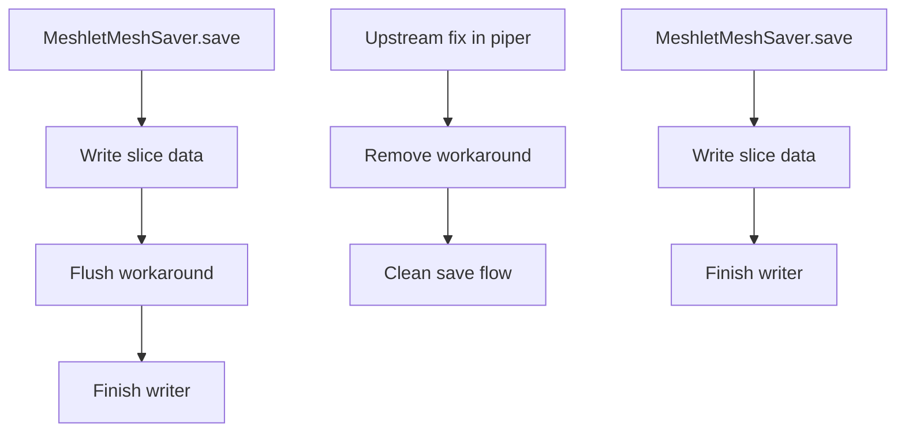

+++
title = "#23228 Delete warning message about corrupted writes."
date = "2026-03-05T00:00:00"
draft = false
template = "pull_request_page.html"
in_search_index = true

[taxonomies]
list_display = ["show"]

[extra]
current_language = "en"
available_languages = {"en" = { name = "English", url = "/pull_request/bevy/2026-03/pr-23228-en-20260305" }, "zh-cn" = { name = "中文", url = "/pull_request/bevy/2026-03/pr-23228-zh-cn-20260305" }}
labels = ["C-Docs", "D-Trivial", "A-Assets"]
+++

# Title
## Basic Information
- **Title**: Delete warning message about corrupted writes.
- **PR Link**: https://github.com/bevyengine/bevy/pull/23228
- **Author**: andriyDev
- **Status**: MERGED
- **Labels**: C-Docs, D-Trivial, A-Assets, S-Ready-For-Final-Review
- **Created**: 2026-03-05T04:00:45Z
- **Merged**: 2026-03-05T05:51:21Z
- **Merged By**: alice-i-cecile

## Description Translation
# Objective

- Remove a stale warning.

## Solution

- This issue is no longer relevant after https://github.com/smol-rs/piper/pull/31. The warning is now removed.
- I also removed the extra flush. Internally finish already calls flush, so everything is fine here.

## Testing

- None.

## The Story of This Pull Request

This pull request addresses a cleanup task in the Bevy game engine's meshlet asset system. The issue was straightforward: the code contained a workaround for a bug that had since been resolved upstream, leaving behind unnecessary code and a misleading comment.

The problem originated in the `MeshletMeshSaver` asset saver implementation. When saving meshlet data to a file, the code included an explicit call to `writer.flush()` accompanied by a comment describing a bug in the `async-fs` crate. The comment referenced GitHub issue https://github.com/smol-rs/async-fs/issues/45, which described a situation where file writes could become corrupted unless flushed explicitly. This workaround was necessary because of a bug in the underlying async I/O layer.

However, the upstream dependency `piper` (which `async-fs` uses internally) had fixed this issue in PR https://github.com/smol-rs/piper/pull/31. Once that fix was integrated into Bevy's dependency tree, the explicit flush became redundant. Worse, the warning comment remained, potentially misleading developers who might encounter it and think the bug still existed.

The solution implemented in this PR is minimal and correct: simply remove the three lines containing the bug comment and the redundant flush call. The `writer.finish()` method already handles flushing internally, so removing the explicit flush doesn't change the functional behavior—it just eliminates unnecessary code.

From an engineering perspective, this change demonstrates several good practices. First, it removes technical debt by cleaning up workarounds for issues that have been resolved. Second, it eliminates a misleading comment that could cause confusion for developers reading the code. Third, it simplifies the implementation by removing redundant operations. The change is also safe because it doesn't alter the actual data flow—the flush still happens, just as part of the `finish()` call rather than as a separate step.

The PR author also correctly identified that the flush was redundant from an API perspective. The `Writer::finish()` method in the relevant I/O library already performs a flush as part of its completion sequence, so the explicit flush was unnecessary even before considering the bug fix.

This change highlights the importance of periodically reviewing workarounds and comments in codebases. When upstream dependencies fix issues, corresponding workarounds in dependent projects should be removed to keep the codebase clean and maintainable. It also shows good dependency hygiene—the Bevy team was aware of the upstream fix and took appropriate action to clean up their codebase accordingly.

## Visual Representation



## Key Files Changed

**File:** `crates/bevy_pbr/src/meshlet/asset.rs`

**Changes:** Removed a redundant flush operation and associated warning comment about a now-fixed bug in async-fs.

**Code diff:**
```rust
// Before:
write_slice(&asset.meshlet_cull_data, &mut writer)?;
// BUG: Flushing helps with an async_fs bug, but it still fails sometimes. https://github.com/smol-rs/async-fs/issues/45
// ERROR bevy_asset::server: Failed to load asset with asset loader MeshletMeshLoader: failed to fill whole buffer
writer.flush()?;
writer.finish()?;

// After:
write_slice(&asset.meshlet_cull_data, &mut writer)?;
writer.finish()?;
```

**Explanation:** The three removed lines consisted of a comment documenting a workaround for an async-fs bug, a related error message comment, and an explicit `flush()` call. After the upstream fix in the piper crate, the bug was resolved, making both the comment and the extra flush unnecessary. The `finish()` method already performs a flush internally, so the functionality remains correct without the explicit call.

## Further Reading

1. **Original async-fs issue:** https://github.com/smol-rs/async-fs/issues/45
2. **Upstream fix in piper:** https://github.com/smol-rs/piper/pull/31
3. **Bevy Asset System Documentation:** https://bevyengine.org/learn/books/assets
4. **Rust I/O Flushing Semantics:** The Rust Programming Language book section on I/O and buffering
5. **Meshlets in Computer Graphics:** Research papers on meshlet-based rendering for real-time graphics