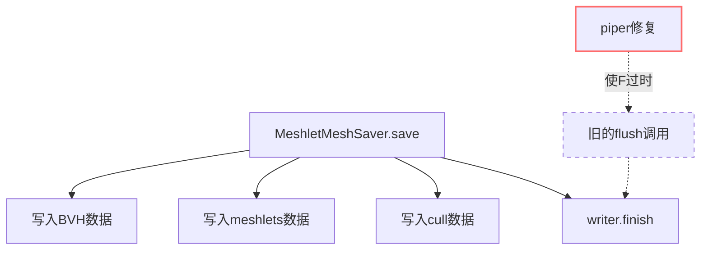

+++
title = "#23228 Delete warning message about corrupted writes."
date = "2026-03-05T00:00:00"
draft = false
template = "pull_request_page.html"
in_search_index = false

[extra]
current_language = "zh-cn"
available_languages = {"en" = { name = "English", url = "/pull_request/bevy/2026-03/pr-23228-en-20260305" }, "zh-cn" = { name = "中文", url = "/pull_request/bevy/2026-03/pr-23228-zh-cn-20260305" }}
+++

# Delete warning message about corrupted writes.

## 基本信息
- **标题**: Delete warning message about corrupted writes.
- **PR 链接**: https://github.com/bevyengine/bevy/pull/23228
- **作者**: andriyDev
- **状态**: 已合并
- **标签**: C-Docs, D-Trivial, A-Assets, S-Ready-For-Review
- **创建时间**: 2026-03-05T04:00:45Z
- **合并时间**: 2026-03-05T05:51:21Z
- **合并人**: alice-i-cecile

## 描述翻译

### 目标
- 移除一个过时的警告信息。

### 解决方案
- 这个问题在 https://github.com/smol-rs/piper/pull/31 之后已不再相关。现在移除了该警告。
- 我还移除了额外的 flush 操作。在内部，finish 已经调用了 flush，所以这里一切正常。

### 测试
- 无。

## 本次 PR 的故事

这次 PR 的起源是一个遗留的 workaround（临时解决方案）需要被清理。问题出现在 `bevy_pbr` 模块的 Meshlet 资产保存逻辑中。

Meshlet 是 Bevy 中用于 mesh 渲染优化的一种技术，它将大的 mesh 分割成更小的网格片（meshlets）以便更高效地进行剔除和渲染。当这些 MeshletMesh 资产被保存到磁盘时，代码中有一个针对特定 bug 的 workaround。

原始代码中包含了三行特殊的处理：

1. 一条注释说明这是一个 BUG，并链接到 `async-fs` 仓库的 issue #45
2. 一条错误消息的注释，提示资产加载时可能失败
3. 一个显式的 `writer.flush()` 调用

这个 bug 涉及异步文件系统操作中的缓冲区问题。在某些情况下，如果没有正确刷新，写入可能不完整，导致读取时出现"failed to fill whole buffer"错误。开发团队当时的解决方案是手动调用 `flush()` 来尝试缓解这个问题，尽管他们知道这并不能完全解决问题。

随着时间的推移，问题的根本原因在依赖链的下游得到了解决。具体来说，`smol-rs/piper` 仓库的 PR #31 修复了底层的问题。`piper` 是一个 Rust 的异步通道实现，它可能被 `async-fs` 或其他异步 I/O 库使用。

修复后，这个 workaround 变得不再必要。实际上，保留它反而可能引入不必要的开销，因为 `writer.finish()` 内部已经包含了 flush 操作，所以显式的 `flush()` 调用是冗余的。

从技术角度看，这个 PR 展示了依赖管理中的良好实践。当底层依赖修复了问题后，应该及时清理上层代码中的 workaround。这不仅使代码更简洁，还能避免潜在的二次刷新带来的性能开销，尽管在这个具体案例中，开销可能微乎其微。

这个修改也体现了软件维护的一个基本原则：注释和代码应该保持同步。当问题被解决后，相关的警告注释应该被移除，否则会误导未来的开发者。

值得注意的是，这个 PR 被标记为 "trivial"（琐碎的），因为它只删除了几行代码。然而，即使是小修改，也能提升代码库的整体健康度。移除过时的 workaround 减少了认知负担，使代码更容易理解和维护。

## 可视化表示



## 关键文件变更

**文件**: `crates/bevy_pbr/src/meshlet/asset.rs`

**变更说明**: 移除了针对已修复的 async-fs bug 的 workaround，包括相关注释和冗余的 flush 调用。

**代码差异**:
```rust
// 之前:
write_slice(&asset.bvh, &mut writer)?;
write_slice(&asset.meshlets, &mut writer)?;
write_slice(&asset.meshlet_cull_data, &mut writer)?;
// BUG: Flushing helps with an async_fs bug, but it still fails sometimes. https://github.com/smol-rs/async-fs/issues/45
// ERROR bevy_asset::server: Failed to load asset with asset loader MeshletMeshLoader: failed to fill whole buffer
writer.flush()?;
writer.finish()?;

// 之后:
write_slice(&asset.bvh, &mut writer)?;
write_slice(&asset.meshlets, &mut writer)?;
write_slice(&asset.meshlet_cull_data, &mut writer)?;
writer.finish()?;
```

**关联性**: 这些变更直接实现了 PR 的目标——移除过时的警告和冗余的 flush 操作。`writer.finish()` 内部已经处理了刷新，所以显式的 flush 调用不再需要。

## 延伸阅读

1. **[Bevy Meshlet 渲染](https://github.com/bevyengine/bevy/pull/10164)** - Meshlet 技术在 Bevy 中的原始实现，提供了背景信息
2. **[Async I/O 中的刷新语义](https://doc.rust-lang.org/std/io/trait.Write.html#tymethod.flush)** - Rust 标准库中 flush 方法的文档，解释了刷新操作的作用
3. **[依赖管理最佳实践](https://doc.rust-lang.org/cargo/guide/managing-dependencies.html)** - 如何有效管理 Rust 项目中的依赖关系
4. **[代码注释维护指南](https://github.com/rust-dev-tools/fmt-rfcs/blob/master/guide/guide.md#comments)** - 关于何时以及如何编写和维护代码注释的指导

---

## 完整代码差异

```diff
diff --git a/crates/bevy_pbr/src/meshlet/asset.rs b/crates/bevy_pbr/src/meshlet/asset.rs
index 3348627d51333..b06acce35b2a0 100644
--- a/crates/bevy_pbr/src/meshlet/asset.rs
+++ b/crates/bevy_pbr/src/meshlet/asset.rs
@@ -184,9 +184,6 @@ impl AssetSaver for MeshletMeshSaver {
         write_slice(&asset.bvh, &mut writer)?;
         write_slice(&asset.meshlets, &mut writer)?;
         write_slice(&asset.meshlet_cull_data, &mut writer)?;
-        // BUG: Flushing helps with an async_fs bug, but it still fails sometimes. https://github.com/smol-rs/async-fs/issues/45
-        // ERROR bevy_asset::server: Failed to load asset with asset loader MeshletMeshLoader: failed to fill whole buffer
-        writer.flush()?;
         writer.finish()?;
 
         Ok(())
```