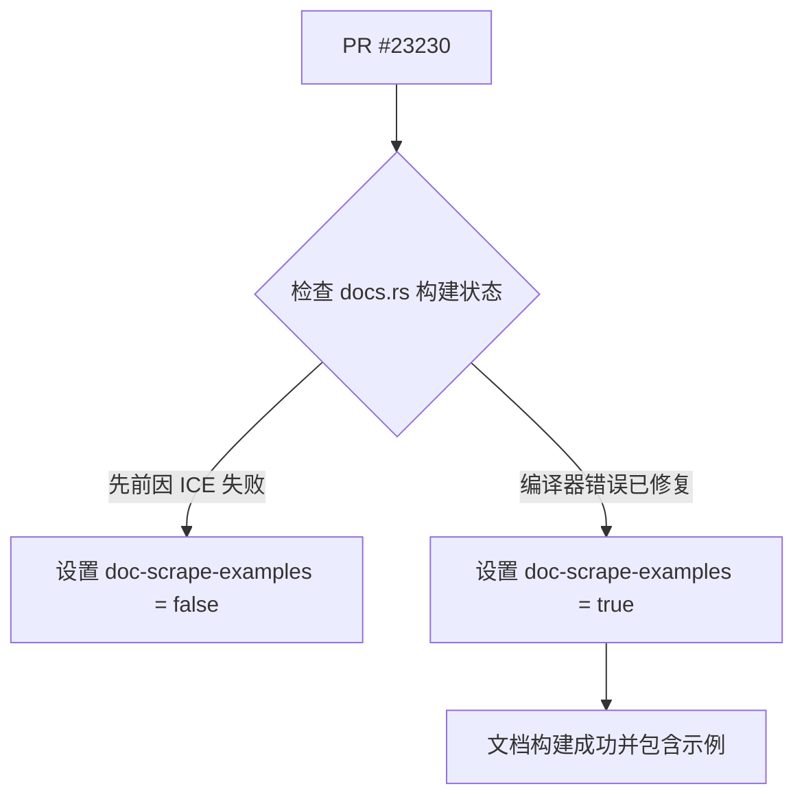

+++
title = "#23230 Set doc-scrape-example = true for recently merged example"
date = "2026-03-05T00:00:00"
draft = false
template = "pull_request_page.html"
in_search_index = false

[extra]
current_language = "zh-cn"
available_languages = {"en" = { name = "English", url = "/pull_request/bevy/2026-03/pr-23230-en-20260305" }, "zh-cn" = { name = "中文", url = "/pull_request/bevy/2026-03/pr-23230-zh-cn-20260305" }}
+++

# Title

## 基本信息
- **标题**: Set doc-scrape-example = true for recently merged example
- **PR 链接**: https://github.com/bevyengine/bevy/pull/23230
- **作者**: kfc35
- **状态**: 已合并
- **标签**: C-Docs, D-Trivial, S-Needs-Review
- **创建时间**: 2026-03-05T06:12:49Z
- **合并时间**: 2026-03-05T07:19:40Z
- **合并者**: mockersf

## 描述翻译
### 目标 (Objective)
- 最近合并的一个 PR 没有将 `doc-scrape-example` 设置为 `true`。

### 解决方案 (Solution)
现在错误已经修复，所有示例都可以被刮取 (scrape) 了，因此将其设置为 `true`。
（此时，所有其他示例都已设置为 `true`）

## 本次 Pull Request 的技术叙事

这是一个维护性的小改动，其背景与 Rust 项目的文档生成和持续集成（CI）流程相关。

**问题与背景**
在 Rust 生态中，`docs.rs` 是一个自动为发布在 `crates.io` 上的库生成文档的网站。它通过运行 `cargo doc` 命令来构建文档。然而，有时构建过程会遇到内部编译器错误（Internal Compiler Error, ICE），这会导致文档构建失败。

Bevy 引擎使用 `#![doc = include_str!("../examples/...")]` 这类属性，将实际示例代码直接嵌入到 API 文档中，这被称为“刮取示例”(scrape-examples)。这是一个很好的实践，能让用户在阅读文档时直接看到相关的、可运行的代码。

在 PR #23230 修改之前，`tilemap_chunk_orientation` 这个示例的配置中有一个注释 `# Causes an ICE on docs.rs`，并且将 `doc-scrape-examples` 设置为 `false`。这表明，在过去的某个时间点，当 `docs.rs` 尝试构建包含此示例的文档时，触发了 Rust 编译器的内部错误，导致整个文档构建失败。为了不阻塞文档的发布，维护者选择临时禁用该示例的刮取功能。

**解决方案**
此 PR 的作者 `kfc35` 注意到，导致 ICE 的底层 Rust 编译器错误已经被修复。因此，现在可以安全地将这个标志重新设置为 `true`，让 `tilemap_chunk_orientation` 示例的代码能够像其他所有示例一样，被正常刮取并显示在生成的文档中。

**实现细节**
修改极其简单，只涉及 `Cargo.toml` 文件中的一个键值对。这个文件使用 TOML 格式，其中 `[package.metadata.example.tilemap_chunk_orientation]` 部分用于配置该示例的元数据。`doc-scrape-examples` 字段控制着构建文档时是否包含该示例的代码。

**影响**
这个改动虽然微小，但具有积极意义：
1.  **恢复了完整的文档功能**：用户现在可以在相关 API 的文档页面上看到 `tilemap_chunk_orientation` 示例的代码，这提升了文档的实用性。
2.  **保持了配置的一致性**：正如 PR 描述中所说，此时所有其他示例都已启用刮取。此修复使该示例的配置与项目标准保持一致。
3.  **反映了上游修复**：它标志着一个阻碍性编译器错误的解决，使得项目能够利用 Rust 工具链的改进。

从工程流程来看，这类改动是项目维护的常规部分。它展示了开发者在依赖外部工具（如编译器和文档服务）时的一种常见模式：遇到工具链问题 -> 实施变通方案（workaround） -> 跟踪问题状态 -> 在问题解决后移除变通方案。

## 视觉表示



## 关键文件变更

- `Cargo.toml` (+1/-1)

**变更详情**
此 PR 只修改了 `Cargo.toml` 文件中与 `tilemap_chunk_orientation` 示例相关的元数据配置。

**代码片段**
```toml
# 文件：Cargo.toml
# 修改前：
[package.metadata.example.tilemap_chunk_orientation]
name = "Tilemap Chunk with Orientations"
...
doc-scrape-examples = false # 在 docs.rs 上会导致 ICE

# 修改后：
[package.metadata.example.tilemap_chunk_orientation]
name = "Tilemap Chunk with Orientations"
...
doc-scrape-examples = true
```

**关系说明**
这个变更直接实现了 PR 的目标：在确认导致构建失败的编译器错误已修复后，重新启用该示例的文档刮取功能。

## 延伸阅读

1.  **Rustdoc 和示例刮取**：Rust 官方文档中关于 `#[doc]` 属性和 `include_str!` 宏的用法，可用于在文档中嵌入外部文件内容。
2.  **docs.rs 构建过程**：`docs.rs` 项目的官方文档，解释了其如何为 `crates.io` 上的包构建文档，以及如何通过 `Cargo.toml` 元数据进行配置（例如 `[package.metadata.docs.rs]`）。
3.  **Cargo 工作区示例配置**：关于在 `Cargo.toml` 的 `[package.metadata.example]` 部分中配置示例的详细信息，可以查阅 Cargo 的文档。
4.  **Rust 编译器错误 (ICE)**：Rust 编译器内部错误是一种严重的 bug，通常需要向 Rust 仓库提交问题报告。Rust 社区有专门的流程来跟踪和修复这类错误。

# Full Code Diff
diff --git a/Cargo.toml b/Cargo.toml
index 42a880ece5504..4dc83dcc41e12 100644
--- a/Cargo.toml
+++ b/Cargo.toml
@@ -1036,7 +1036,7 @@ wasm = true
 name = "tilemap_chunk_orientation"
 path = "examples/2d/tilemap_chunk_orientation.rs"
 # Causes an ICE on docs.rs
-doc-scrape-examples = false
+doc-scrape-examples = true
 
 [package.metadata.example.tilemap_chunk_orientation]
 name = "Tilemap Chunk with Orientations"