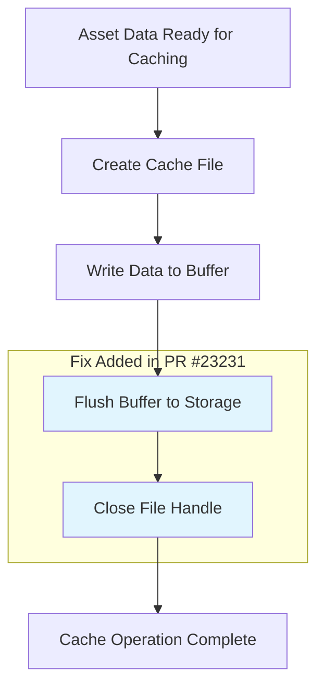

+++
title = "#23231 Close the web_asset_cache file before ending the cache future."
date = "2026-03-05T00:00:00"
draft = false
template = "pull_request_page.html"
in_search_index = true

[taxonomies]
list_display = ["show"]

[extra]
current_language = "en"
available_languages = {"en" = { name = "English", url = "/pull_request/bevy/2026-03/pr-23231-en-20260305" }, "zh-cn" = { name = "中文", url = "/pull_request/bevy/2026-03/pr-23231-zh-cn-20260305" }}
labels = ["C-Bug", "D-Trivial", "A-Assets"]
+++

# Title
Close the web_asset_cache file before ending the cache future.

## Basic Information
- **Title**: Close the web_asset_cache file before ending the cache future.
- **PR Link**: https://github.com/bevyengine/bevy/pull/23231
- **Author**: andriyDev
- **Status**: MERGED
- **Labels**: C-Bug, D-Trivial, A-Assets, S-Ready-For-Final-Review
- **Created**: 2026-03-05T07:18:09Z
- **Merged**: 2026-03-05T08:24:33Z
- **Merged By**: mockersf

## Description Translation

# Objective

- bevy_city is failing for some users, even after https://github.com/smol-rs/piper/pull/31.

## Solution

- Close (and thus flush) the file before calling the caching done.

## Testing

- Ran bevy_city a few times deleting the cache each time. Seems to work!

## The Story of This Pull Request

This PR addresses a subtle but critical issue in Bevy's web asset caching system. The problem manifested as intermittent failures in the `bevy_city` example, where assets weren't being cached properly on the web platform, even after a previous fix was applied to the underlying async I/O library.

At the technical level, the issue was related to file write buffering in WebAssembly environments. When Bevy writes asset data to the browser's IndexedDB for caching purposes, the asynchronous write operation doesn't guarantee immediate persistence to the underlying storage. The `async_fs::File` implementation for web platforms uses JavaScript's FileSystem Access API, which performs buffered writes.

The core problem was that the code was creating a file, writing data to it, and then immediately returning from the future without ensuring the file was properly closed. In file I/O systems, closing a file typically triggers a flush operation that writes any buffered data to the actual storage. Without this explicit close, the operating system (or in this case, the browser's storage APIs) might not immediately persist the written data to disk.

Here's the relevant code from the `web_asset_cache` module before the fix:

```rust
let mut cache_file = async_fs::File::create(&cache_path).await?;
cache_file.write_all(data).await?;

Ok(())
```

The issue was that after `write_all()` completes, the data might still be in an internal buffer, not yet written to persistent storage. When the future ends and the `cache_file` variable goes out of scope, Rust's drop mechanism should close the file, but the timing of this drop in an async context might not guarantee immediate flushing, especially in WebAssembly environments where I/O operations are handled by JavaScript promises.

The solution was straightforward: explicitly call `.close().await?` on the file handle:

```rust
let mut cache_file = async_fs::File::create(&cache_path).await?;
cache_file.write_all(data).await?;
cache_file.close().await?;

Ok(())
```

This explicit close ensures that:
1. Any buffered data is flushed to the underlying storage
2. The file handle is properly released
3. The operation completes synchronously before the future returns

The choice to use `close().await` rather than relying on implicit drop behavior is a common pattern in async file I/O. It makes the code's intent explicit and ensures proper ordering of operations. This is particularly important in WebAssembly environments where the JavaScript runtime's event loop and promise resolution can lead to non-deterministic behavior if operations aren't explicitly sequenced.

The testing approach mentioned in the PR description - running `bevy_city` multiple times while deleting the cache each time - validates that the fix works by ensuring:
1. Assets can be written to the cache
2. Subsequent runs can successfully read from the cache
3. The cache survives across browser sessions (implied by not deleting it)

This fix demonstrates an important principle in systems programming: when dealing with external resources like files, explicit management of lifecycle operations (open/close) is often safer than relying on implicit cleanup, especially in async contexts where timing can be unpredictable.

## Visual Representation



## Key Files Changed

### `crates/bevy_asset/src/io/web.rs` (+1/-0)

This file contains the web-specific implementation of Bevy's asset I/O system. The change adds an explicit file close operation in the web asset caching mechanism.

**Context**: The `web_asset_cache` module handles caching of assets in web environments using the browser's IndexedDB for persistent storage. When assets are loaded, they're written to this cache so subsequent loads can read from local storage instead of making network requests.

**Key modification**:
```rust
// File: crates/bevy_asset/src/io/web.rs
// Before:
let mut cache_file = async_fs::File::create(&cache_path).await?;
cache_file.write_all(data).await?;

Ok(())

// After:
let mut cache_file = async_fs::File::create(&cache_path).await?;
cache_file.write_all(data).await?;
cache_file.close().await?;

Ok(())
```

The addition of `cache_file.close().await?;` ensures that the file is properly closed and flushed before the caching operation completes. This prevents race conditions where the cache future might complete before the file data is actually persisted to storage.

## Further Reading

1. **Async-std/async-fs documentation**: The `async_fs::File` API and its behavior in different environments
2. **Web FileSystem Access API**: How browsers handle file operations in WebAssembly contexts
3. **Rust async/await drop semantics**: Understanding how resources are cleaned up in async contexts
4. **Bevy Asset System Architecture**: How Bevy handles asset loading and caching across different platforms