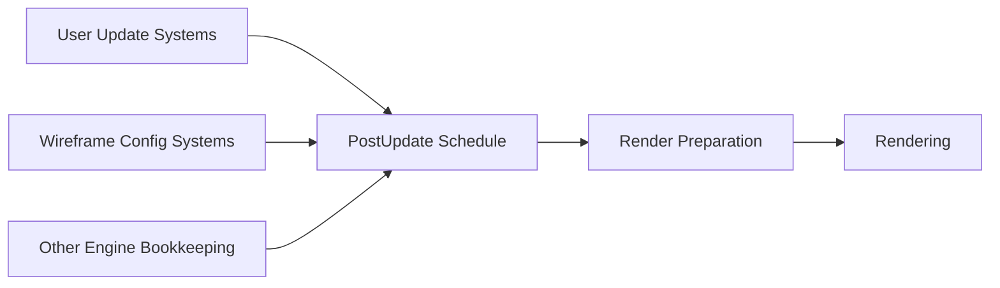

+++
title = "#23240 Fix wireframe system ordering."
date = "2026-03-06T00:00:00"
draft = false
template = "pull_request_page.html"
in_search_index = true

[taxonomies]
list_display = ["show"]

[extra]
current_language = "en"
available_languages = {"en" = { name = "English", url = "/pull_request/bevy/2026-03/pr-23240-en-20260306" }, "zh-cn" = { name = "中文", url = "/pull_request/bevy/2026-03/pr-23240-zh-cn-20260306" }}
labels = ["D-Trivial", "A-Rendering"]
+++

# Fix wireframe system ordering

## Basic Information
- **Title**: Fix wireframe system ordering.
- **PR Link**: https://github.com/bevyengine/bevy/pull/23240
- **Author**: tychedelia
- **Status**: MERGED
- **Labels**: D-Trivial, A-Rendering, S-Needs-Review
- **Created**: 2026-03-06T04:51:56Z
- **Merged**: 2026-03-06T08:18:51Z
- **Merged By**: mockersf

## Description
Wireframe stuff runs in `Update` which makes it difficult to order against for user stuff that needs to spawn pre-wireframe. This is also just not idiomatic, engine bookkeeping should run in `PostUpdate`.

## The Story of This Pull Request

This pull request addresses a system ordering issue in Bevy's wireframe rendering system. The problem was straightforward but important: the wireframe configuration update systems were scheduled in the `Update` schedule, which created ordering conflicts with user code and violated Bevy's established conventions for system scheduling.

The core issue stemmed from the fact that wireframe-related systems - specifically `wireframe_config_changed` and `wireframe_color_changed` - were registered to run in the `Update` schedule. In Bevy's execution model, `Update` is intended for user game logic, while `PostUpdate` is designed for engine bookkeeping and cleanup operations that should happen after all user logic has completed.

This scheduling choice created practical problems for developers. When users needed to spawn entities or modify components in their `Update` systems that should affect wireframe rendering, they faced ordering challenges. The wireframe systems running in `Update` could execute before or after user systems, leading to inconsistent behavior. More importantly, this arrangement violated the principle that engine systems responsible for updating internal state based on configuration changes should run in `PostUpdate`, after all user modifications have been applied.

The solution implemented in this PR is minimal and focused: move the wireframe configuration update systems from `Update` to `PostUpdate`. This change required only two modifications to the codebase:

1. Update the import statement to remove the `Update` import (since it was no longer needed)
2. Change the schedule registration from `Update` to `PostUpdate`

This change aligns the wireframe system with Bevy's standard scheduling conventions. By running in `PostUpdate`, these systems now:
- Execute after all user `Update` systems, ensuring that any entity spawning or component modifications from user code are complete
- Follow the established pattern where engine bookkeeping systems run in later schedules
- Eliminate ordering conflicts between user systems and wireframe configuration updates

The technical implementation is straightforward because the systems themselves don't need modification - only their scheduling context changes. The `wireframe_config_changed` system reacts to changes in the `WireframeConfig` resource, and `wireframe_color_changed` responds to changes in the `WireframeColor` resource. Both systems were already properly implemented with `run_if` conditions (`resource_changed::<WireframeConfig>` for the former) to optimize execution.

This change demonstrates an important aspect of Bevy's scheduling philosophy: clear separation between user logic and engine maintenance. The `PostUpdate` schedule serves as a cleanup phase where engine systems can safely update internal state based on user modifications made during `Update`. This separation helps prevent race conditions and makes system ordering more predictable.

From a performance perspective, moving these systems to `PostUpdate` has minimal impact. The systems only run when their respective resources change (thanks to the `run_if` conditions), so they're already optimized for minimal execution. The scheduling change primarily affects when they run relative to user systems, not how often they run.

The fix also aligns with other wireframe-related systems. Looking at the broader context of the wireframe implementation, other wireframe systems like mesh instance updates and flag updates already run in `PostUpdate`, making this change consistent with the existing architecture.

## Visual Representation



## Key Files Changed

### `crates/bevy_pbr/src/wireframe.rs` (+2/-2)

This file contains the wireframe rendering implementation in Bevy's physically-based rendering (PBR) crate. The changes involve updating the schedule for wireframe configuration systems from `Update` to `PostUpdate`.

**Key modifications:**

1. **Import statement update:**
```rust
// Before:
use bevy_app::{App, Plugin, PostUpdate, Startup, Update};

// After:
use bevy_app::{App, Plugin, PostUpdate, Startup};
```

2. **System schedule registration:**
```rust
// Before:
.add_systems(
    Update,
    (
        wireframe_config_changed.run_if(resource_changed::<WireframeConfig>),
        wireframe_color_changed,
    ),
)

// After:
.add_systems(
    PostUpdate,
    (
        wireframe_config_changed.run_if(resource_changed::<WireframeConfig>),
        wireframe_color_changed,
    ),
)
```

These changes ensure that wireframe configuration updates occur after all user `Update` systems have run, following Bevy's established scheduling conventions where engine bookkeeping systems belong in `PostUpdate`.

## Further Reading

1. **Bevy Schedules Documentation**: Understanding Bevy's scheduling system and the purpose of different schedules like `Update`, `PostUpdate`, and `PreUpdate`
2. **System Ordering in Bevy**: How to control system execution order within and across schedules
3. **Conditional System Execution**: Using `run_if` conditions to optimize system execution frequency
4. **Bevy Render Graph Architecture**: How rendering systems integrate with Bevy's overall execution model
5. **Resource Change Detection**: How Bevy tracks changes to resources and components for efficient system execution