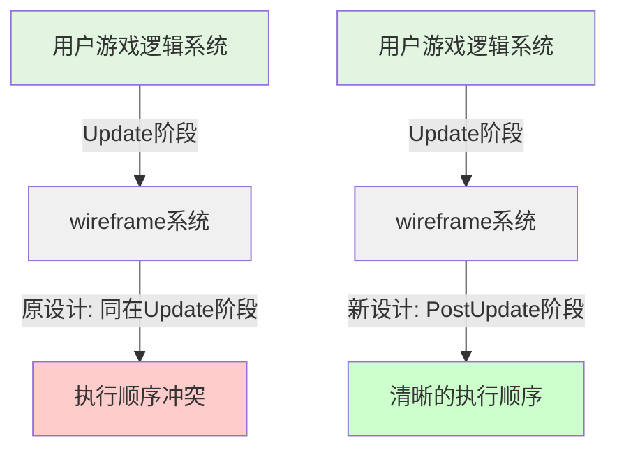

+++
title = "#23240 Fix wireframe system ordering."
date = "2026-03-06T00:00:00"
draft = false
template = "pull_request_page.html"
in_search_index = false

[extra]
current_language = "zh-cn"
available_languages = {"en" = { name = "English", url = "/pull_request/bevy/2026-03/pr-23240-en-20260306" }, "zh-cn" = { name = "中文", url = "/pull_request/bevy/2026-03/pr-23240-zh-cn-20260306" }}
+++

# Title
Fix wireframe system ordering.

## Basic Information
- **Title**: Fix wireframe system ordering.
- **PR Link**: https://github.com/bevyengine/bevy/pull/23240
- **作者**: tychedelia
- **状态**: 已合并
- **标签**: D-Trivial, A-Rendering, S-Needs-Review
- **创建时间**: 2026-03-06T04:51:56Z
- **合并时间**: 2026-03-06T08:18:51Z
- **合并者**: mockersf

## 描述翻译
线框（wireframe）相关系统在 `Update` 阶段运行，这使得用户很难安排需要在wireframe之前执行的任务（比如生成对象）。这样的设计也不符合Bevy引擎的惯用模式，引擎的内部维护工作应该放在 `PostUpdate` 阶段进行。

## 本PR的故事

这个PR解决了一个关于执行顺序的问题，具体是关于Bevy渲染引擎中wireframe系统的调度时机。

问题的核心在于wireframe系统当前在 `Update` schedule阶段运行。在Bevy的架构中，`Update` 阶段是专门为游戏逻辑设计的，而引擎内部的状态更新和簿记工作应该放在 `PostUpdate` 阶段。这种设计模式让用户更容易理解和安排他们自己的系统执行顺序。

当一个用户想要在wireframe系统之前执行某些逻辑（比如生成一些实体），他们会发现很难正确地进行排序。因为wireframe系统在 `Update` 阶段运行，用户必须在同一个阶段内安排他们的系统，并且要确保在wireframe系统之前执行。由于 `Update` 阶段主要用于游戏逻辑，将引擎内部系统放在这里会导致概念上的混淆和执行顺序上的困难。

开发者采取了一个直接且简洁的解决方案：将wireframe系统从 `Update` schedule移动到 `PostUpdate` schedule。这个改动很小但很关键，它遵循了Bevy引擎的标准模式，让引擎内部系统在游戏逻辑完成后运行。

从技术实现角度来看，这个改动只需要修改两行代码。第一处是导入语句，移除了对 `Update` 的显式导入，因为不再需要它。第二处是将系统注册的目标schedule从 `Update` 改为 `PostUpdate`。

这种改变有几个技术优势：
1. **符合架构模式**：让wireframe系统在 `PostUpdate` 运行符合Bevy的惯用设计模式
2. **改善执行顺序**：用户现在可以更容易地在 `Update` 阶段安排他们的系统，知道这些系统会在wireframe处理之前完成
3. **减少概念混淆**：将引擎内部系统与用户游戏逻辑分离，使代码更易于理解

从性能角度考虑，这个改动不会产生负面影响。实际上，通过将系统移到正确的schedule中，它可能通过减少执行顺序的复杂性而带来微小的性能提升。

这个PR展示了一个重要的软件工程原则：遵守框架的约定和模式可以让代码更可预测、更易于维护。即使是一个只有两行代码的改动，也能显著改善系统的可理解性和使用体验。

## 可视化表示



## 关键文件更改

**crates/bevy_pbr/src/wireframe.rs** (+2/-2)

这个文件包含了wireframe系统的实现。主要改动是将系统从`Update` schedule移动到`PostUpdate` schedule，以改善执行顺序并符合Bevy的架构模式。

```rust
// 文件: crates/bevy_pbr/src/wireframe.rs

// 之前:
use bevy_app::{App, Plugin, PostUpdate, Startup, Update};
// ... 其他代码 ...
    .add_systems(
        Update,
        (
            wireframe_config_changed.run_if(resource_changed::<WireframeConfig>),
            wireframe_color_changed,
```

```rust
// 之后:
use bevy_app::{App, Plugin, PostUpdate, Startup};
// ... 其他代码 ...
    .add_systems(
        PostUpdate,
        (
            wireframe_config_changed.run_if(resource_changed::<WireframeConfig>),
            wireframe_color_changed,
```

这些改动直接解决了PR描述中提到的问题：将wireframe系统从`Update`移到`PostUpdate`，使得用户更容易安排需要在wireframe之前执行的系统，同时也符合Bevy引擎的惯用模式。

## 完整代码差异
```
diff --git a/crates/bevy_pbr/src/wireframe.rs b/crates/bevy_pbr/src/wireframe.rs
index 235a5f64f2a50..e9b0546cc28a6 100644
--- a/crates/bevy_pbr/src/wireframe.rs
+++ b/crates/bevy_pbr/src/wireframe.rs
@@ -4,7 +4,7 @@ use crate::{
     RenderMeshInstanceFlags, RenderMeshInstances, SetMeshBindGroup, SetMeshViewBindGroup,
     SetMeshViewBindingArrayBindGroup, ViewKeyCache,
 };
-use bevy_app::{App, Plugin, PostUpdate, Startup, Update};
+use bevy_app::{App, Plugin, PostUpdate, Startup};
 use bevy_asset::{
     embedded_asset, load_embedded_asset, prelude::AssetChanged, AsAssetId, Asset, AssetApp,
     AssetEventSystems, AssetId, AssetServer, Assets, Handle, UntypedAssetId,
@@ -100,7 +100,7 @@ impl Plugin for WireframePlugin {
         .register_type::<WireframeTopology>()
         .add_systems(Startup, setup_global_wireframe_material)
         .add_systems(
-            Update,
+            PostUpdate,
             (
                 wireframe_config_changed.run_if(resource_changed::<WireframeConfig>),
                 wireframe_color_changed,
```

## 进一步阅读

- [Bevy Engine Schedules Documentation](https://docs.rs/bevy/latest/bevy/app/struct.App.html#method.add_systems) - Bevy调度系统的官方文档
- [Bevy Engine States and Stages](https://bevy-cheatbook.github.io/programming/stages.html) - Bevy阶段和状态系统的详细指南
- [System Ordering in Bevy](https://bevy-cheatbook.github.io/programming/system-order.html) - Bevy中系统执行顺序的详细说明
- [E-Commerce Systems Architecture](https://github.com/bevyengine/bevy/tree/main/examples/ecs) - Bevy实体组件系统的示例和模式