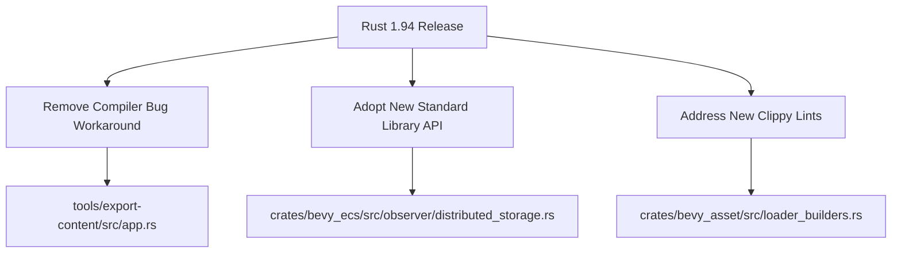

+++
title = "#23241 Rust 1.94"
date = "2026-03-06T00:00:00"
draft = false
template = "pull_request_page.html"
in_search_index = true

[taxonomies]
list_display = ["show"]

[extra]
current_language = "en"
available_languages = {"en" = { name = "English", url = "/pull_request/bevy/2026-03/pr-23241-en-20260306" }, "zh-cn" = { name = "中文", url = "/pull_request/bevy/2026-03/pr-23241-zh-cn-20260306" }}
labels = ["D-Trivial", "A-Build-System", "C-Code-Quality"]
+++

# Title: Rust 1.94

## Basic Information
- **Title**: Rust 1.94
- **PR Link**: https://github.com/bevyengine/bevy/pull/23241
- **Author**: tychedelia
- **Status**: MERGED
- **Labels**: D-Trivial, A-Build-System, C-Code-Quality, S-Ready-For-Final-Review
- **Created**: 2026-03-06T05:00:19Z
- **Merged**: 2026-03-06T07:08:00Z
- **Merged By**: mockersf

## Description Translation
https://blog.rust-lang.org/2026/03/05/Rust-1.94.0/

## The Story of This Pull Request

This PR addresses three separate but related updates following the release of Rust 1.94.0. Each change is minimal but demonstrates the ongoing maintenance required to keep a large codebase like Bevy compatible with the evolving Rust ecosystem.

The first change removes a workaround for a Rust compiler bug that was fixed in version 1.94. In `tools/export-content/src/app.rs`, the code previously contained an `#![expect]` attribute suppressing an `unused_assignments` warning originating from inside the `miette` diagnostic library. This warning was caused by Rust issue #147648, which has now been resolved. Removing this attribute cleans up the code and eliminates the need for the workaround.

The second change updates pointer handling in the ECS observer system to use the new `core::ptr::from_mut` function introduced in Rust 1.94. In `crates/bevy_ecs/src/observer/distributed_storage.rs`, the code was previously using an `as` cast to convert a mutable reference to a raw pointer. The new `from_mut` function provides a more explicit and potentially safer alternative for this conversion. This change follows Rust's ongoing trend of replacing implicit casts with explicit functions where appropriate.

The third change adds an `#[expect]` attribute to suppress a Clippy lint warning about large error types in `crates/bevy_asset/src/loader_builders.rs`. The `result_large_err` lint warns when a `Result` type contains a large error variant, which could impact performance. However, in this case, the developer determined that asset loading is not a performance-critical path, so the warning can be safely suppressed. This decision is documented with a clear rationale, maintaining code quality standards while avoiding unnecessary refactoring.

These three changes together show a pattern of reactive maintenance: removing workarounds for fixed compiler bugs, adopting new standard library features, and selectively suppressing lints with documented justifications. Each change is small but contributes to the overall health and modernization of the codebase.

## Visual Representation



## Key Files Changed

**File**: `tools/export-content/src/app.rs` (+0/-5)
1. Removed the `#![expect]` attribute that was suppressing warnings from a Rust compiler bug that has been fixed in version 1.94.

```rust
// Before:
#![expect(
    unused_assignments,
    reason = "Warnings from inside miette due to a rustc bug: https://github.com/rust-lang/rust/issues/147648"
)]

use std::{env, fs, io::Write, path::PathBuf};

// After:
use std::{env, fs, io::Write, path::PathBuf};
```

**File**: `crates/bevy_ecs/src/observer/distributed_storage.rs` (+1/-1)
1. Updated pointer conversion to use the new `core::ptr::from_mut` function introduced in Rust 1.94.

```rust
// Before:
let system: &mut dyn Any = observer.system.as_mut();
system.downcast_mut::<S>().unwrap() as *mut dyn ObserverSystem<E, B>

// After:
let system: &mut dyn Any = observer.system.as_mut();
core::ptr::from_mut(system.downcast_mut::<S>().unwrap())
```

**File**: `crates/bevy_asset/src/loader_builders.rs` (+1/-0)
1. Added an `#[expect]` attribute to suppress the `result_large_err` Clippy lint with a documented rationale.

```rust
// Added:
#[expect(clippy::result_large_err, reason = "Asset loading is not a hot path.")]
pub async fn load<'p, A: Asset>(
    self,
    path: impl Into<AssetPath<'p>>,
```

## Further Reading

1. [Rust 1.94.0 Release Notes](https://blog.rust-lang.org/2026/03/05/Rust-1.94.0/) - Official announcement with details about new features and changes
2. [Rust Issue #147648](https://github.com/rust-lang/rust/issues/147648) - The compiler bug that was fixed in this release
3. [`core::ptr::from_mut` documentation](https://doc.rust-lang.org/std/ptr/fn.from_mut.html) - Details about the new pointer conversion function
4. [Clippy's `result_large_err` lint](https://rust-lang.github.io/rust-clippy/master/#result_large_err) - Documentation for the Clippy lint addressed in this PR
5. [Rust's attribute system](https://doc.rust-lang.org/reference/attributes.html) - Understanding `#![expect]` and other attributes