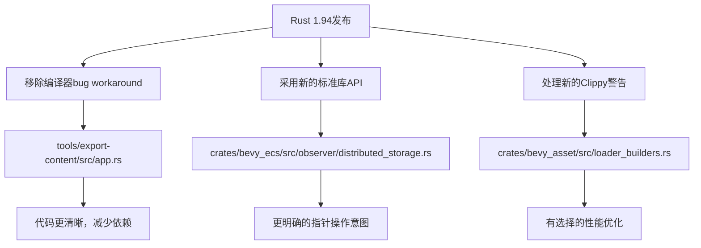

+++
title = "#23241 Rust 1.94"
date = "2026-03-06T00:00:00"
draft = false
template = "pull_request_page.html"
in_search_index = false

[extra]
current_language = "zh-cn"
available_languages = {"en" = { name = "English", url = "/pull_request/bevy/2026-03/pr-23241-en-20260306" }, "zh-cn" = { name = "中文", url = "/pull_request/bevy/2026-03/pr-23241-zh-cn-20260306" }}
+++

# Rust 1.94

## 基本信息
- **标题**: Rust 1.94
- **PR链接**: https://github.com/bevyengine/bevy/pull/23241
- **作者**: tychedelia
- **状态**: 已合并
- **标签**: D-Trivial, A-Build-System, C-Code-Quality, S-Ready-For-Final-Review
- **创建时间**: 2026-03-06T05:00:19Z
- **合并时间**: 2026-03-06T07:08:00Z
- **合并人**: mockersf

## 描述翻译

https://blog.rust-lang.org/2026/03/05/Rust-1.94.0/

## 这个Pull Request的故事

这次PR的核心是更新Bevy代码库以适配最新的Rust 1.94版本。这是一个典型的维护性更新，主要涉及三个方面：消除因Rust编译器修复而不再需要的workaround、更新代码以使用新的标准库API，以及对新增的Clippy警告进行适当处理。

从技术背景来看，Rust 1.94版本修复了之前版本中存在的一些问题，这意味着Bevy代码库中原本为规避这些问题而添加的代码现在可以安全移除。同时，新版本也引入了新的API和编译器行为，需要相应调整代码以保持最佳实践。

首先看到的是`tools/export-content/src/app.rs`中的变化。这里移除了一个针对特定编译器bug的expect属性。原来的代码中添加了`#![expect(unused_assignments)]`来抑制由miette库触发的假阳性警告，这是因为Rust编译器在issue #147648中存在的bug导致的。随着Rust 1.94修复了这个bug，这个workaround就不再需要了。这种清理工作很重要，因为它减少了代码的复杂性，移除了对特定编译器版本的依赖，让代码更加清晰。

```rust
// 文件: tools/export-content/src/app.rs
// 之前:
#![expect(
    unused_assignments,
    reason = "Warnings from inside miette due to a rustc bug: https://github.com/rust-lang/rust/issues/147648"
)]

// 之后:
// 移除了整个expect属性
```

接下来在`crates/bevy_ecs/src/observer/distributed_storage.rs`中，我们看到一个技术性更强的改动。这里将原来的类型转换方式从使用`as`关键字改为使用`core::ptr::from_mut()`函数。这个改变体现了更明确的意图表达和类型安全性的提升。`core::ptr::from_mut()`是Rust标准库中更明确的指针转换函数，它清晰地表达了"获取可变裸指针"的意图，而不是依赖`as`的隐式转换语义。

```rust
// 文件: crates/bevy_ecs/src/observer/distributed_storage.rs
// 之前:
system.downcast_mut::<S>().unwrap() as *mut dyn ObserverSystem<E, B>

// 之后:
core::ptr::from_mut(system.downcast_mut::<S>().unwrap())
```

这个改动虽然微小，但体现了Rust编程中的最佳实践：使用标准库提供的专门函数进行指针操作，而不是依赖`as`的隐式转换。这样在代码审查时更容易理解作者的意图，也减少了潜在的错误。

第三个改动在`crates/bevy_asset/src/loader_builders.rs`中，这里添加了一个`#[expect]`属性来抑制Clippy的`result_large_err`警告。这个警告在Rust 1.94中可能是新增的或默认启用的。开发者需要判断这个警告是否适用于当前场景，在这里作者认为资产加载不是性能关键路径（"not a hot path"），因此可以容忍较大的错误类型。

```rust
// 文件: crates/bevy_asset/src/loader_builders.rs
// 之前:
pub async fn load<'p, A: Asset>(
    self,
    path: impl Into<AssetPath<'p>>,
) -> Result<ErasedAssetHandle, AssetLoadError> {

// 之后:
#[expect(clippy::result_large_err, reason = "Asset loading is not a hot path.")]
pub async fn load<'p, A: Asset>(
    self,
    path: impl Into<AssetPath<'p>>,
) -> Result<ErasedAssetHandle, AssetLoadError> {
```

这里的技术决策是基于性能权衡的。`result_large_err`警告提示错误类型过大可能会影响复制性能，但在资产加载这种I/O密集型操作中，错误类型的大小通常不是瓶颈。开发者通过添加明确的理由说明，记录了为什么选择忽略这个警告，这为后续维护者提供了上下文。

从工程角度看，这次PR展示了维护大型Rust项目的几个关键实践：
1. **及时跟进编译器更新**：修复编译器bug后立即移除workaround
2. **采用新的标准库API**：使用更明确的函数替代隐式转换
3. **有选择地处理警告**：不是所有警告都需要修复，需要根据具体场景判断

这些改动虽然不大，但对于保持代码库的健康状态很重要。它们确保了Bevy能够充分利用Rust语言的最新改进，同时保持代码的清晰性和可维护性。

## 视觉表示



## 关键文件变更

### 1. `tools/export-content/src/app.rs` (+0/-5)
**变更说明**：移除了针对Rust编译器bug #147648的workaround。这个bug在Rust 1.94中已被修复，因此不再需要抑制相关警告。

**关键代码变更**：
```rust
// 移除了以下代码：
#![expect(
    unused_assignments,
    reason = "Warnings from inside miette due to a rustc bug: https://github.com/rust-lang/rust/issues/147648"
)]
```

**与PR目的的关系**：这是对Rust 1.94修复编译器bug的直接响应，清理了不再需要的代码。

### 2. `crates/bevy_ecs/src/observer/distributed_storage.rs` (+1/-1)
**变更说明**：将使用`as`关键字进行的指针转换改为使用`core::ptr::from_mut()`函数，使指针操作的意图更明确。

**关键代码变更**：
```rust
// 之前:
system.downcast_mut::<S>().unwrap() as *mut dyn ObserverSystem<E, B>

// 之后:
core::ptr::from_mut(system.downcast_mut::<S>().unwrap())
```

**与PR目的的关系**：采用了Rust标准库中更现代的API，提高了代码的清晰度和类型安全性。

### 3. `crates/bevy_asset/src/loader_builders.rs` (+1/-0)
**变更说明**：添加Clippy警告抑制，针对`result_large_err`警告，明确说明资产加载不是性能关键路径。

**关键代码变更**：
```rust
// 添加的属性：
#[expect(clippy::result_large_err, reason = "Asset loading is not a hot path.")]
```

**与PR目的的关系**：处理Rust 1.94可能新增或启用的Clippy警告，做出有根据的工程决策。

## 进一步阅读

1. **Rust 1.94发布说明**: https://blog.rust-lang.org/2026/03/05/Rust-1.94.0/
2. **Rust编译器issue #147648**: https://github.com/rust-lang/rust/issues/147648
3. **Rust裸指针操作文档**: https://doc.rust-lang.org/std/primitive.pointer.html
4. **Clippy的result_large_err警告**: https://rust-lang.github.io/rust-clippy/master/index.html#result_large_err
5. **Bevy资产系统文档**: https://bevyengine.org/learn/book/next/features/assets/

## 完整代码差异

```diff
diff --git a/crates/bevy_asset/src/loader_builders.rs b/crates/bevy_asset/src/loader_builders.rs
index eed5edcdfa587..878f87ca11c05 100644
--- a/crates/bevy_asset/src/loader_builders.rs
+++ b/crates/bevy_asset/src/loader_builders.rs
@@ -471,6 +471,7 @@ impl NestedLoader<'_, '_, StaticTyped, Immediate<'_, '_>> {
     ///
     /// [`with_dynamic_type`]: Self::with_dynamic_type
     /// [`with_unknown_type`]: Self::with_unknown_type
+    #[expect(clippy::result_large_err, reason = "Asset loading is not a hot path.")]
     pub async fn load<'p, A: Asset>(
         self,
         path: impl Into<AssetPath<'p>>,
diff --git a/crates/bevy_ecs/src/observer/distributed_storage.rs b/crates/bevy_ecs/src/observer/distributed_storage.rs
index 12a063a879b86..054a3904c1862 100644
--- a/crates/bevy_ecs/src/observer/distributed_storage.rs
+++ b/crates/bevy_ecs/src/observer/distributed_storage.rs
@@ -469,7 +469,7 @@ fn hook_on_add<E: Event, B: Bundle, S: ObserverSystem<E, B>>(
             observer.descriptor.components.extend(components);
 
             let system: &mut dyn Any = observer.system.as_mut();
-            system.downcast_mut::<S>().unwrap() as *mut dyn ObserverSystem<E, B>
+            core::ptr::from_mut(system.downcast_mut::<S>().unwrap())
         };
 
         // SAFETY: World reference is exclusive and initialize does not touch system, so references do not alias
diff --git a/tools/export-content/src/app.rs b/tools/export-content/src/app.rs
index f734375ccb45a..7fa2be0d1a494 100644
--- a/tools/export-content/src/app.rs
+++ b/tools/export-content/src/app.rs
@@ -1,8 +1,3 @@
-#![expect(
-    unused_assignments,
-    reason = "Warnings from inside miette due to a rustc bug: https://github.com/rust-lang/rust/issues/147648"
-)]
-
 use std::{env, fs, io::Write, path::PathBuf};
 
 use miette::{diagnostic, Context, Diagnostic, IntoDiagnostic, NamedSource, Result};
```