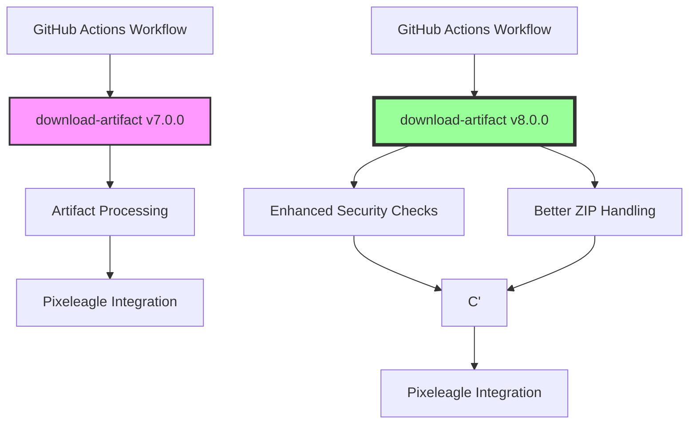

+++
title = "#23243 Bump actions/download-artifact from 7.0.0 to 8.0.0"
date = "2026-03-06T00:00:00"
draft = false
template = "pull_request_page.html"
in_search_index = true

[taxonomies]
list_display = ["show"]

[extra]
current_language = "en"
available_languages = {"en" = { name = "English", url = "/pull_request/bevy/2026-03/pr-23243-en-20260306" }, "zh-cn" = { name = "中文", url = "/pull_request/bevy/2026-03/pr-23243-zh-cn-20260306" }}
labels = ["C-Dependencies"]
+++

# Title
## Bump actions/download-artifact from 7.0.0 to 8.0.0

## Basic Information
- **Title**: Bump actions/download-artifact from 7.0.0 to 8.0.0
- **PR Link**: https://github.com/bevyengine/bevy/pull/23243
- **Author**: app/dependabot
- **Status**: MERGED
- **Labels**: C-Dependencies
- **Created**: 2026-03-06T06:52:17Z
- **Merged**: 2026-03-06T19:02:40Z
- **Merged By**: mockersf

## Description Translation
Bumps [actions/download-artifact](https://github.com/actions/download-artifact) from 7.0.0 to 8.0.0.
<details>
<summary>Release notes</summary>
<p><em>Sourced from <a href="https://github.com/actions/download-artifact/releases">actions/download-artifact's releases</a>.</em></p>
<blockquote>
<h2>v8.0.0</h2>
<h2>v8 - What's new</h2>
<h3>Direct downloads</h3>
<p>To support direct uploads in <code>actions/upload-artifact</code>, the action will no longer attempt to unzip all downloaded files. Instead, the action checks the <code>Content-Type</code> header ahead of unzipping and skips non-zipped files. Callers wishing to download a zipped file as-is can also set the new <code>skip-decompress</code> parameter to <code>false</code>.</p>
<h3>Enforced checks (breaking)</h3>
<p>A previous release introduced digest checks on the download. If a download hash didn't match the expected hash from the server, the action would log a warning. Callers can now configure the behavior on mismatch with the <code>digest-mismatch</code> parameter. To be secure by default, we are now defaulting the behavior to <code>error</code> which will fail the workflow run.</p>
<h3>ESM</h3>
<p>To support new versions of the @actions/* packages, we've upgraded the package to ESM.</p>
<h2>What's Changed</h2>
<ul>
<li>Don't attempt to un-zip non-zipped downloads by <a href="https://github.com/danwkennedy"><code>@​danwkennedy</code></a> in <a href="https://redirect.github.com/actions/download-artifact/pull/460">actions/download-artifact#460</a></li>
<li>Add a setting to specify what to do on hash mismatch and default it to <code>error</code> by <a href="https://github.com/danwkennedy"><code>@​danwkennedy</code></a> in <a href="https://redirect.github.com/actions/download-artifact/pull/461">actions/download-artifact#461</a></li>
</ul>
<p><strong>Full Changelog</strong>: <a href="https://github.com/actions/download-artifact/compare/v7...v8.0.0">https://github.com/actions/download-artifact/compare/v7...v8.0.0</a></p>
</blockquote>
</details>
<details>
<summary>Commits</summary>
<ul>
<li><a href="https://github.com/actions/download-artifact/commit/70fc10c6e5e1ce46ad2ea6f2b72d43f7d47b13c3"><code>70fc10c</code></a> Merge pull request <a href="https://redirect.github.com/actions/download-artifact/issues/461">#461</a> from actions/danwkennedy/digest-mismatch-behavior</li>
<li><a href="https://github.com/actions/download-artifact/commit/f258da9a506b755b84a09a531814700b86ccfc62"><code>f258da9</code></a> Add change docs</li>
<li><a href="https://github.com/actions/download-artifact/commit/ccc058e5fbb0bb2352213eaec3491e117cbc4a5c"><code>ccc058e</code></a> Fix linting issues</li>
<li><a href="https://github.com/actions/download-artifact/commit/bd7976ba57ecea96e6f3df575eb922d11a12a9fd"><code>bd7976b</code></a> Add a setting to specify what to do on hash mismatch and default it to <code>error</code></li>
<li><a href="https://github.com/actions/download-artifact/commit/ac21fcf45e0aaee541c0f7030558bdad38d77d6c"><code>ac21fcf</code></a> Merge pull request <a href="https://redirect.github.com/actions/download-artifact/issues/460">#460</a> from actions/danwkennedy/download-no-unzip</li>
<li><a href="https://github.com/actions/download-artifact/commit/15999bff51058bc7c19b50ebbba518eaef7c26c0"><code>15999bf</code></a> Add note about package bumps</li>
<li><a href="https://github.com/actions/download-artifact/commit/974686ed5098c7f9c9289ec946b9058e496a2561"><code>974686e</code></a> Bump the version to <code>v8</code> and add release notes</li>
<li><a href="https://github.com/actions/download-artifact/commit/fbe48b1d2756394be4cd4358ed3bc1343b330e75"><code>fbe48b1</code></a> Update test names to make it clearer what they do</li>
<li><a href="https://github.com/actions/download-artifact/commit/96bf374a614d4360e225874c3efd6893a3f285e7"><code>96bf374</code></a> One more test fix</li>
<li><a href="https://github.com/actions/download-artifact/commit/b8c4819ef592cbe04fd93534534b38f853864332"><code>b8c4819</code></a> Fix skip decompress test</li>
<li>Additional commits viewable in <a href="https://github.com/actions/download-artifact/compare/37930b1c2abaa49bbe596cd826c3c89aef350131...70fc10c6e5e1ce46ad2ea6f2b72d43f7d47b13c3">compare view</a></li>
</ul>
</details>
<br />


[](https://docs.github.com/en/github/managing-security-vulnerabilities/about-dependabot-security-updates#about-compatibility-scores)

Dependabot will resolve any conflicts with this PR as long as you don't alter it yourself. You can also trigger a rebase manually by commenting `@dependabot rebase`.

[//]: # (dependabot-automerge-start)
[//]: # (dependabot-automerge-end)

---

<details>
<summary>Dependabot commands and options</summary>
<br />

You can trigger Dependabot actions by commenting on this PR:
- `@dependabot rebase` will rebase this PR
- `@dependabot recreate` will recreate this PR, overwriting any edits that have been made to it
- `@dependabot show <dependency name> ignore conditions` will show all of the ignore conditions of the specified dependency
- `@dependabot ignore this major version` will close this PR and stop Dependabot creating any more for this major version (unless you reopen the PR or upgrade to it yourself)
- `@dependabot ignore this minor version` will close this PR and stop Dependabot creating any more for this minor version (unless you reopen the PR or upgrade to it yourself)
- `@dependabot ignore this dependency` will close this PR and stop Dependabot creating any more for this dependency (unless you reopen the PR or upgrade to it yourself)


</details>

## The Story of This Pull Request

This PR is a straightforward dependency update managed by Dependabot, GitHub's automated dependency management tool. The change updates the `actions/download-artifact` GitHub Action from version 7.0.0 to version 8.0.0 in Bevy's CI/CD pipeline. While it might appear to be a simple version bump, it introduces several important changes that affect how artifacts are handled in Bevy's continuous integration workflows.

The core issue being addressed is maintaining compatibility with upstream changes in GitHub's artifact handling ecosystem. The `actions/download-artifact` action is a critical component in Bevy's CI pipeline, particularly for the `send-screenshots-to-pixeleagle` workflow which handles visual regression testing by uploading and downloading screenshot artifacts. When the upstream dependency released a new major version with breaking changes, Dependabot automatically created this PR to ensure Bevy's workflows continue to function correctly.

Version 8.0.0 introduces three significant changes that affect Bevy's workflow behavior. First, the action now properly handles direct (non-zipped) downloads by checking the `Content-Type` header before attempting to unzip files. This change supports the new direct upload feature in `actions/upload-artifact@v4`, though Bevy isn't using that specific feature yet. The action will automatically skip decompression for non-zipped files, which could be important if Bevy's workflow evolves to use direct uploads in the future.

More importantly, version 8.0.0 changes the default behavior for hash verification failures. Previously, if a downloaded artifact's hash didn't match the expected value from the server, the action would only log a warning. Now, by default, it fails the workflow run entirely. This represents a security improvement, ensuring that corrupted or tampered artifacts don't get processed downstream. Bevy's screenshot comparison workflow benefits from this change because it prevents potentially corrupted screenshots from being sent to external services like Pixeleagle.

The third change is an internal migration to ECMAScript modules (ESM), which doesn't directly affect Bevy's usage but ensures compatibility with newer versions of the underlying `@actions/*` packages.

The implementation itself is minimal - a single line change in one workflow file. However, the implications are significant for the reliability and security of Bevy's CI pipeline. By accepting this update, Bevy gains improved security defaults and better handling of different artifact types, while maintaining compatibility with the evolving GitHub Actions ecosystem.

From an engineering perspective, this update demonstrates the importance of keeping CI/CD dependencies current, especially when they involve security-related behavior changes. The breaking change in hash verification behavior is particularly noteworthy because it could cause previously passing workflows to fail if they were silently downloading corrupted artifacts. In Bevy's case, this is a positive change that increases the reliability of visual regression testing.

## Visual Representation



## Key Files Changed

### `.github/workflows/send-screenshots-to-pixeleagle.yml` (+1/-1)

This file contains the GitHub Actions workflow that handles screenshot artifact processing for visual regression testing. The workflow downloads screenshot artifacts generated during test runs and sends them to Pixeleagle, an external service for visual comparison and review.

**Change Details:**
The change updates the pinned version of the `actions/download-artifact` action from the v7.0.0 commit hash to the v8.0.0 commit hash.

```yaml
# File: .github/workflows/send-screenshots-to-pixeleagle.yml
# Before:
- name: Download artifact
  if: ${{ fromJSON(env.PIXELEAGLE_TOKEN_EXISTS) }}
  uses: actions/download-artifact@37930b1c2abaa49bbe596cd826c3c89aef350131 # v7.0.0
  with:
    pattern: ${{ inputs.artifact }}

# After:
- name: Download artifact
  if: ${{ fromJSON(env.PIXELEAGLE_TOKEN_EXISTS) }}
  uses: actions/download-artifact@70fc10c6e5e1ce46ad2ea6f2b72d43f7d47b13c3 # v8.0.0
  with:
    pattern: ${{ inputs.artifact }}
```

**Why This Change Matters:**
This update ensures that Bevy's screenshot processing workflow benefits from the security improvements in v8.0.0, particularly the stricter hash verification that now fails the workflow if downloaded artifacts are corrupted or tampered with. Since visual regression testing relies on accurate screenshot comparisons, this change helps maintain the integrity of the testing process.

## Further Reading

1. **GitHub Actions Documentation**: [Downloading workflow artifacts](https://docs.github.com/en/actions/using-workflows/storing-workflow-data-as-artifacts#downloading-workflow-artifacts)
2. **GitHub Actions Security Hardening**: [Security hardening for GitHub Actions](https://docs.github.com/en/actions/security-guides/security-hardening-for-github-actions)
3. **Artifact Integrity Verification**: [About artifact integrity verification](https://docs.github.com/en/actions/security-guides/encrypted-secrets#using-encrypted-secrets-in-a-workflow)
4. **ESM Migration Guide**: [ECMAScript modules in Node.js](https://nodejs.org/api/esm.html)
5. **Dependabot Documentation**: [Keeping your dependencies updated automatically](https://docs.github.com/en/code-security/dependabot/dependabot-version-updates/about-dependabot-version-updates)

# Full Code Diff
```diff
diff --git a/.github/workflows/send-screenshots-to-pixeleagle.yml b/.github/workflows/send-screenshots-to-pixeleagle.yml
index 24ae7c1b6c175..11623f9151b9d 100644
--- a/.github/workflows/send-screenshots-to-pixeleagle.yml
+++ b/.github/workflows/send-screenshots-to-pixeleagle.yml
@@ -44,7 +44,7 @@ jobs:
 
       - name: Download artifact
         if: ${{ fromJSON(env.PIXELEAGLE_TOKEN_EXISTS) }}
-        uses: actions/download-artifact@37930b1c2abaa49bbe596cd826c3c89aef350131 # v7.0.0
+        uses: actions/download-artifact@70fc10c6e5e1ce46ad2ea6f2b72d43f7d47b13c3 # v8.0.0
         with:
           pattern: ${{ inputs.artifact }}
```