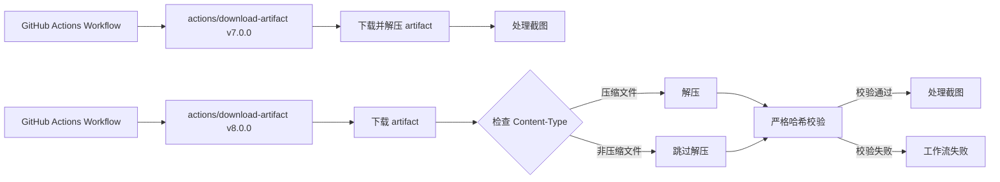

+++
title = "#23243 Bump actions/download-artifact from 7.0.0 to 8.0.0"
date = "2026-03-06T00:00:00"
draft = false
template = "pull_request_page.html"
in_search_index = false

[extra]
current_language = "zh-cn"
available_languages = {"en" = { name = "English", url = "/pull_request/bevy/2026-03/pr-23243-en-20260306" }, "zh-cn" = { name = "中文", url = "/pull_request/bevy/2026-03/pr-23243-zh-cn-20260306" }}
+++

# Title

## 基本资讯
- **标题**: Bump actions/download-artifact from 7.0.0 to 8.0.0
- **PR 链接**: https://github.com/bevyengine/bevy/pull/23243
- **作者**: app/dependabot
- **状态**: 已合并
- **标签**: C-Dependencies
- **创建时间**: 2026-03-06T06:52:17Z
- **合并时间**: 2026-03-06T19:02:40Z
- **合并者**: mockersf

## 描述翻译

将 [actions/download-artifact](https://github.com/actions/download-artifact) 从 7.0.0 更新至 8.0.0。
<details>
<summary>发行说明</summary>
<p><em>源自 <a href="https://github.com/actions/download-artifact/releases">actions/download-artifact 的发行说明</a>。</em></p>
<blockquote>
<h2>v8.0.0</h2>
<h2>v8 - 新功能</h2>
<h3>直接下载</h3>
<p>为了支持 <code>actions/upload-artifact</code> 中的直接上传，该 action 将不再尝试解压缩所有下载的文件。相反，该 action 会在解压缩前检查 <code>Content-Type</code> 头部，并跳过非压缩文件。希望按原样下载压缩文件的调用者也可以将新的 <code>skip-decompress</code> 参数设置为 <code>false</code>。</p>
<h3>强制校验（破坏性变更）</h3>
<p>先前的一个版本引入了下载时的摘要校验。如果下载的哈希值与服务器预期的哈希值不匹配，该 action 会记录一个警告。调用者现在可以通过 <code>digest-mismatch</code> 参数来配置不匹配时的行为。为了默认确保安全，我们现在将默认行为设置为 <code>error</code>，这将导致工作流运行失败。</p>
<h3>ESM</h3>
<p>为了支持新版本的 @actions/* 软件包，我们已将软件包升级到 ESM。</p>
<h2>变更内容</h2>
<ul>
<li>不要尝试解压缩非压缩的下载文件，由 <a href="https://github.com/danwkennedy"><code>@​danwkennedy</code></a> 在 <a href="https://redirect.github.com/actions/download-artifact/pull/460">actions/download-artifact#460</a> 中完成</li>
<li>添加一个设置来指定哈希不匹配时的处理方式，并默认设为 <code>error</code>，由 <a href="https://github.com/danwkennedy"><code>@​danwkennedy</code></a> 在 <a href="https://redirect.github.com/actions/download-artifact/pull/461">actions/download-artifact#461</a> 中完成</li>
</ul>
<p><strong>完整更新日志</strong>: <a href="https://github.com/actions/download-artifact/compare/v7...v8.0.0">https://github.com/actions/download-artifact/compare/v7...v8.0.0</a></p>
</blockquote>
</details>
<details>
<summary>提交</summary>
<ul>
<li><a href="https://github.com/actions/download-artifact/commit/70fc10c6e5e1ce46ad2ea6f2b72d43f7d47b13c3"><code>70fc10c</code></a> Merge pull request <a href="https://redirect.github.com/actions/download-artifact/issues/461">#461</a> from actions/danwkennedy/digest-mismatch-behavior</li>
<li><a href="https://github.com/actions/download-artifact/commit/f258da9a506b755b84a09a531814700b86ccfc62"><code>f258da9</code></a> Add change docs</li>
<li><a href="https://github.com/actions/download-artifact/commit/ccc058e5fbb0bb2352213eaec3491e117cbc4a5c"><code>ccc058e</code></a> Fix linting issues</li>
<li><a href="https://github.com/actions/download-artifact/commit/bd7976ba57ecea96e6f3df575eb922d11a12a9fd"><code>bd7976b</code></a> Add a setting to specify what to do on hash mismatch and default it to <code>error</code></li>
<li><a href="https://github.com/actions/download-artifact/commit/ac21fcf45e0aaee541c0f7030558bdad38d77d6c"><code>ac21fcf</code></a> Merge pull request <a href="https://redirect.github.com/actions/download-artifact/issues/460">#460</a> from actions/danwkennedy/download-no-unzip</li>
<li><a href="https://github.com/actions/download-artifact/commit/15999bff51058bc7c19b50ebbba518eaef7c26c0"><code>15999bf</code></a> Add note about package bumps</li>
<li><a href="https://github.com/actions/download-artifact/commit/974686ed5098c7f9c9289ec946b9058e496a2561"><code>974686e</code></a> Bump the version to <code>v8</code> and add release notes</li>
<li><a href="https://github.com/actions/download-artifact/commit/fbe48b1d2756394be4cd4358ed3bc1343b330e75"><code>fbe48b1</code></a> Update test names to make it clearer what they do</li>
<li><a href="https://github.com/actions/download-artifact/commit/96bf374a614d4360e225874c3efd6893a3f285e7"><code>96bf374</code></a> One more test fix</li>
<li><a href="https://github.com/actions/download-artifact/commit/b8c4819ef592cbe04fd93534534b38f853864332"><code>b8c4819</code></a> Fix skip decompress test</li>
<li>更多提交可在 <a href="https://github.com/actions/download-artifact/compare/37930b1c2abaa49bbe596cd826c3c89aef350131...70fc10c6e5e1ce46ad2ea6f2b72d43f7d47b13c3">比较视图</a> 中查看</li>
</ul>
</details>
<br />


[](https://docs.github.com/en/github/managing-security-vulnerabilities/about-dependabot-security-updates#about-compatibility-scores)

只要你不自行修改此 PR，Dependabot 将解决所有冲突。你也可以通过评论 `@dependabot rebase` 手动触发变基。

[//]: # (dependabot-automerge-start)
[//]: # (dependabot-automerge-end)

---

<details>
<summary>Dependabot 命令和选项</summary>
<br />

你可以通过评论此 PR 来触发 Dependabot 操作：
- `@dependabot rebase` 将对此 PR 进行变基
- `@dependabot recreate` 将重新创建此 PR，覆盖已对其所做的任何编辑
- `@dependabot show <dependency name> ignore conditions` 将显示指定依赖项的所有忽略条件
- `@dependabot ignore this major version` 将关闭此 PR 并停止 Dependabot 为此主要版本创建更多 PR（除非你重新打开 PR 或自行升级到此版本）
- `@dependabot ignore this minor version` 将关闭此 PR 并停止 Dependabot 为此次要版本创建更多 PR（除非你重新打开 PR 或自行升级到此版本）
- `@dependabot ignore this dependency` 将关闭此 PR 并停止 Dependabot 为此依赖项创建更多 PR（除非你重新打开 PR 或自行升级到此版本）


</details>

## 这个 PR 的故事

这个 PR 的故事始于 GitHub 的自动化依赖管理工具 Dependabot。Dependabot 持续监控项目依赖，并在发现新版本时自动创建更新 PR。这次它检测到 Bevy 项目在 CI/CD 工作流中使用的 `actions/download-artifact` 从 v7.0.0 升级到了 v8.0.0，这是一个主要版本更新，意味着可能包含破坏性变更（breaking changes）。

从表面看，这只是单个 YAML 文件中一行版本号的变更。但深入分析后，这次更新涉及三个重要的技术改进。首先，v8.0.0 引入了对直接下载非压缩文件的支持，这是为了与 `actions/upload-artifact` 的直接上传功能保持一致。新版本会检查 `Content-Type` 头部，仅解压缩实际是压缩文件的下载项，这提高了工作流的灵活性和效率。

更重要的是第二个变更：哈希校验行为的改变。在 v7 版本中，如果下载文件的哈希值与服务器预期值不匹配，action 只会记录警告。而 v8 默认将这种行为改为报错（error），导致工作流运行失败。这是一个重要的安全加固，确保下载的文件完整性得到严格验证，防止潜在的供应链攻击或数据损坏问题。用户现在可以通过 `digest-mismatch` 参数自定义这种行为。

第三个变更是底层技术栈的升级：action 从 CommonJS 迁移到了 ESM（ECMAScript Modules）。这主要是为了支持新版本的 @actions/* 软件包，确保与 GitHub Actions 生态系统的其他部分保持兼容。

对于 Bevy 项目来说，这次更新特别影响的是 `send-screenshots-to-pixeleagle` 工作流。这个工作流负责在测试运行后下载截图 artifact 并发送到 PixelEagle 服务进行可视化比较。哈希校验的严格化意味着如果 artifact 在传输过程中损坏或被篡改，工作流会立即失败，而不是继续处理可能无效的数据。

维护者 mockersf 在审查这个 PR 时，需要考虑这个破坏性变更对现有工作流的影响。由于 Dependabot 显示的兼容性评分表明更新是安全的，且新版本的默认安全增强符合现代安全实践，合并这个 PR 是合理的决定。整个更新过程展示了自动化依赖管理的价值：团队可以及时获得安全性和功能改进，而无需手动跟踪每个依赖的更新。

## 视觉表示



## 关键文件变更

**`.github/workflows/send-screenshots-to-pixeleagle.yml`** (+1/-1)

这个文件定义了一个 GitHub Actions 工作流，用于在 CI 测试后下载生成的截图 artifact 并将其发送到 PixelEagle 服务进行可视化比较。唯一的变更是将 `actions/download-artifact` action 的版本从 v7.0.0 更新到 v8.0.0。

```yaml
# 文件: .github/workflows/send-screenshots-to-pixeleagle.yml
# 变更前:
      - name: Download artifact
        if: ${{ fromJSON(env.PIXELEAGLE_TOKEN_EXISTS) }}
        uses: actions/download-artifact@37930b1c2abaa49bbe596cd826c3c89aef350131 # v7.0.0
        with:
          pattern: ${{ inputs.artifact }}

# 变更后:
      - name: Download artifact
        if: ${{ fromJSON(env.PIXELEAGLE_TOKEN_EXISTS) }}
        uses: actions/download-artifact@70fc10c6e5e1ce46ad2ea6f2b72d43f7d47b13c3 # v8.0.0
        with:
          pattern: ${{ inputs.artifact }}
```

这个变更直接对应 PR 的主要目的：更新依赖版本。虽然代码修改很小，但引入了 v8.0.0 的所有新功能和安全改进，特别是更严格的哈希校验，这对确保下载的截图 artifact 的完整性很重要。

## 延伸阅读

1.  [GitHub Actions 官方文档](https://docs.github.com/en/actions) - 了解 GitHub Actions 工作流的基本概念和用法
2.  [actions/download-artifact 仓库](https://github.com/actions/download-artifact) - 查看该 action 的源代码、问题和最新版本
3.  [关于 Dependabot 版本更新](https://docs.github.com/en/code-security/dependabot/dependabot-version-updates/about-dependabot-version-updates) - 了解 Dependabot 如何自动化依赖管理
4.  [供应链安全最佳实践](https://docs.github.com/en/code-security/supply-chain-security/understanding-your-software-supply-chain) - 学习如何保护软件供应链，包括依赖管理
5.  [ESM 与 CommonJS 的区别](https://nodejs.org/api/esm.html) - 理解这次更新中涉及的模块系统变更

# Full Code Diff

```diff
diff --git a/.github/workflows/send-screenshots-to-pixeleagle.yml b/.github/workflows/send-screenshots-to-pixeleagle.yml
index 24ae7c1b6c175..11623f9151b9d 100644
--- a/.github/workflows/send-screenshots-to-pixeleagle.yml
+++ b/.github/workflows/send-screenshots-to-pixeleagle.yml
@@ -44,7 +44,7 @@ jobs:
 
       - name: Download artifact
         if: ${{ fromJSON(env.PIXELEAGLE_TOKEN_EXISTS) }}
-        uses: actions/download-artifact@37930b1c2abaa49bbe596cd826c3c89aef350131 # v7.0.0
+        uses: actions/download-artifact@70fc10c6e5e1ce46ad2ea6f2b72d43f7d47b13c3 # v8.0.0
         with:
           pattern: ${{ inputs.artifact }}
```