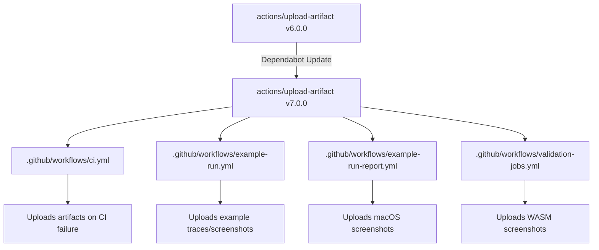

+++
title = "#23244 Bump actions/upload-artifact from 6.0.0 to 7.0.0"
date = "2026-03-06T00:00:00"
draft = false
template = "pull_request_page.html"
in_search_index = true

[taxonomies]
list_display = ["show"]

[extra]
current_language = "en"
available_languages = {"en" = { name = "English", url = "/pull_request/bevy/2026-03/pr-23244-en-20260306" }, "zh-cn" = { name = "中文", url = "/pull_request/bevy/2026-03/pr-23244-zh-cn-20260306" }}
labels = ["C-Dependencies"]
+++

# Title

## Basic Information
- **Title**: Bump actions/upload-artifact from 6.0.0 to 7.0.0
- **PR Link**: https://github.com/bevyengine/bevy/pull/23244
- **Author**: app/dependabot
- **Status**: MERGED
- **Labels**: C-Dependencies
- **Created**: 2026-03-06T06:54:22Z
- **Merged**: 2026-03-06T19:04:14Z
- **Merged By**: mockersf

## Description Translation
The PR description is already in English, so here it is preserved exactly as-is:

Bumps [actions/upload-artifact](https://github.com/actions/upload-artifact) from 6.0.0 to 7.0.0.
<details>
<summary>Release notes</summary>
<p><em>Sourced from <a href="https://github.com/actions/upload-artifact/releases">actions/upload-artifact's releases</a>.</em></p>
<blockquote>
<h2>v7.0.0</h2>
<h2>v7 What's new</h2>
<h3>Direct Uploads</h3>
<p>Adds support for uploading single files directly (unzipped). Callers can set the new <code>archive</code> parameter to <code>false</code> to skip zipping the file during upload. Right now, we only support single files. The action will fail if the glob passed resolves to multiple files. The <code>name</code> parameter is also ignored with this setting. Instead, the name of the artifact will be the name of the uploaded file.</p>
<h3>ESM</h3>
<p>To support new versions of the <code>@actions/*</code> packages, we've upgraded the package to ESM.</p>
<h2>What's Changed</h2>
<ul>
<li>Add proxy integration test by <a href="https://github.com/Link"><code>@​Link</code></a>- in <a href="https://redirect.github.com/actions/upload-artifact/pull/754">actions/upload-artifact#754</a></li>
<li>Upgrade the module to ESM and bump dependencies by <a href="https://github.com/danwkennedy"><code>@​danwkennedy</code></a> in <a href="https://redirect.github.com/actions/upload-artifact/pull/762">actions/upload-artifact#762</a></li>
<li>Support direct file uploads by <a href="https://github.com/danwkennedy"><code>@​danwkennedy</code></a> in <a href="https://redirect.github.com/actions/upload-artifact/pull/764">actions/upload-artifact#764</a></li>
</ul>
<h2>New Contributors</h2>
<ul>
<li><a href="https://github.com/Link"><code>@​Link</code></a>- made their first contribution in <a href="https://redirect.github.com/actions/upload-artifact/pull/754">actions/upload-artifact#754</a></li>
</ul>
<p><strong>Full Changelog</strong>: <a href="https://github.com/actions/upload-artifact/compare/v6...v7.0.0">https://github.com/actions/upload-artifact/compare/v6...v7.0.0</a></p>
</blockquote>
</details>
<details>
<summary>Commits</summary>
<ul>
<li><a href="https://github.com/actions/upload-artifact/commit/bbbca2ddaa5d8feaa63e36b76fdaad77386f024f"><code>bbbca2d</code></a> Support direct file uploads (<a href="https://redirect.github.com/actions/upload-artifact/issues/764">#764</a>)</li>
<li><a href="https://github.com/actions/upload-artifact/commit/589182c5a4cec8920b8c1bce3e2fab1c97a02296"><code>589182c</code></a> Upgrade the module to ESM and bump dependencies (<a href="https://redirect.github.com/actions/upload-artifact/issues/762">#762</a>)</li>
<li><a href="https://github.com/actions/upload-artifact/commit/47309c993abb98030a35d55ef7ff34b7fa1074b5"><code>47309c9</code></a> Merge pull request <a href="https://redirect.github.com/actions/upload-artifact/issues/754">#754</a> from actions/Link-/add-proxy-integration-tests</li>
<li><a href="https://github.com/actions/upload-artifact/commit/02a8460834e70dab0ce194c64360c59dc1475ef0"><code>02a8460</code></a> Add proxy integration test</li>
<li>See full diff in <a href="https://github.com/actions/upload-artifact/compare/b7c566a772e6b6bfb58ed0dc250532a479d7789f...bbbca2ddaa5d8feaa63e36b76fdaad77386f024f">compare view</a></li>
</ul>
</details>
<br />


[](https://docs.github.com/en/github/managing-security-vulnerabilities/about-dependabot-security-updates#about-compatibility-scores)

Dependabot will resolve any conflicts with this PR as long as you don't alter it yourself. You can also trigger a rebase manually by commenting `@dependabot rebase`.

[//]: # (dependabot-automerge-start)
[//]: # (dependabot-automerge-end)

---

<details>
<summary>Dependabot commands and options</summary>
<br />

You can trigger Dependabot actions by commenting on this PR:
- `@dependabot rebase` will rebase this PR
- `@dependabot recreate` will recreate this PR, overwriting any edits that have been made to it
- `@dependabot show <dependency name> ignore conditions` will show all of the ignore conditions of the specified dependency
- `@dependabot ignore this major version` will close this PR and stop Dependabot creating any more for this major version (unless you reopen the PR or upgrade to it yourself)
- `@dependabot ignore this minor version` will close this PR and stop Dependabot creating any more for this minor version (unless you reopen the PR or upgrade to it yourself)
- `@dependabot ignore this dependency` will close this PR and stop Dependabot creating any more for this dependency (unless you reopen the PR or upgrade to it yourself)


</details>

## The Story of This Pull Request

This PR is a straightforward dependency update, but it illustrates how modern software projects manage their CI/CD pipeline dependencies through automated tooling. The Bevy project uses GitHub Actions for its continuous integration workflows, and these workflows rely on various third-party actions. One of these is `actions/upload-artifact`, which handles uploading files generated during CI runs as workflow artifacts.

When Dependabot, GitHub's dependency management bot, detected that `actions/upload-artifact` had a new major release (v7.0.0), it automatically created this PR to update the Bevy project's workflows. The update process is simple but systematic: Dependabot locates all references to the old version in the repository and replaces them with the new version.

Looking at the changes, we can see that four workflow files were updated:
- `ci.yml` (the main CI workflow)
- `example-run.yml` (workflow for running examples)
- `example-run-report.yml` (workflow for generating example reports)
- `validation-jobs.yml` (workflow for validation tasks)

In each case, the update follows the same pattern: the action reference is changed from a specific commit hash (`b7c566a772e6b6bfb58ed0dc250532a479d7789f`) representing v6.0.0 to a new commit hash (`bbbca2ddaa5d8feaa63e36b76fdaad77386f024f`) representing v7.0.0. Using commit hashes rather than version tags provides exact version pinning and ensures reproducibility.

The release notes for v7.0.0 indicate two significant changes. First, the action now supports direct file uploads without compression by setting `archive: false`. This could be useful for Bevy's workflows when uploading single files like logs or test results, potentially reducing processing overhead. Second, the package has been upgraded to ESM (ECMAScript Modules), which modernizes the codebase and ensures compatibility with newer versions of the `@actions/*` packages.

From an engineering perspective, this PR demonstrates good dependency management practices. The update is minimal and focused - it only changes the version references without modifying any workflow logic. The maintainer (mockersf) reviewed and merged the PR, indicating that the compatibility score (shown in the PR description) and any automated testing gave sufficient confidence that the update wouldn't break existing workflows.

The PR also shows how Dependabot's automated update process works in practice. The bot provides clear commands for managing the PR, handles rebasing if needed, and includes useful metadata like compatibility scores and release notes. This automation reduces the maintenance burden on the Bevy team while keeping dependencies current.

## Visual Representation



## Key Files Changed

### 1. `.github/workflows/ci.yml` (+3/-3)
This is the main CI workflow file. The changes update the `actions/upload-artifact` version in three job steps where artifacts are uploaded on test failure.

**Before:**
```yaml
- uses: actions/upload-artifact@b7c566a772e6b6bfb58ed0dc250532a479d7789f # v6.0.0
```

**After:**
```yaml
- uses: actions/upload-artifact@bbbca2ddaa5d8feaa63e36b76fdaad77386f024f # v7.0.0
```

**Context:** These changes occur in the `check-missing-examples`, `check-missing-features`, and `msrv` jobs where artifacts are uploaded when tests fail during pull request validation.

### 2. `.github/workflows/example-run.yml` (+9/-9)
This workflow runs Bevy examples and uploads traces and screenshots. All nine references to the action were updated.

**Example before:**
```yaml
- uses: actions/upload-artifact@b7c566a772e6b6bfb58ed0dc250532a479d7789f # v6.0.0
  with:
    name: example-traces-macos
    path: traces
```

**Example after:**
```yaml
- uses: actions/upload-artifact@bbbca2ddaa5d8feaa63e36b76fdaad77386f024f # v7.0.0
  with:
    name: example-traces-macos
    path: traces
```

**Context:** The workflow runs on macOS, Linux, and Windows, uploading traces and screenshots from example runs, plus additional artifacts when failures occur.

### 3. `.github/workflows/example-run-report.yml` (+1/-1)
This workflow generates reports from example runs and uploads screenshots.

**Before:**
```yaml
- uses: actions/upload-artifact@b7c566a772e6b6bfb58ed0dc250532a479d7789f # v6.0.0
```

**After:**
```yaml
- uses: actions/upload-artifact@bbbca2ddaa5d8feaa63e36b76fdaad77386f024f # v7.0.0
```

**Context:** Uploads macOS screenshots for example run reports.

### 4. `.github/workflows/validation-jobs.yml` (+1/-1)
This workflow handles validation jobs including WASM example testing.

**Before:**
```yaml
- uses: actions/upload-artifact@b7c566a772e6b6bfb58ed0dc250532a479d7789f # v6.0.0
```

**After:**
```yaml
- uses: actions/upload-artifact@bbbca2ddaa5d8feaa63e36b76fdaad77386f024f # v7.0.0
```

**Context:** Uploads screenshots from WASM example testing in the `wasm-example` job.

## Further Reading

1. [GitHub Actions Documentation](https://docs.github.com/en/actions) - Official documentation for GitHub Actions
2. [actions/upload-artifact Repository](https://github.com/actions/upload-artifact) - Source code and documentation for the action being updated
3. [Dependabot Documentation](https://docs.github.com/en/code-security/dependabot) - How Dependabot manages dependency updates
4. [ESM (ECMAScript Modules) Guide](https://developer.mozilla.org/en-US/docs/Web/JavaScript/Guide/Modules) - Technical details about JavaScript modules
5. [GitHub Actions Artifacts](https://docs.github.com/en/actions/using-workflows/storing-workflow-data-as-artifacts) - How artifacts work in GitHub Actions

# Full Code Diff
See the original PR description for the complete diff.