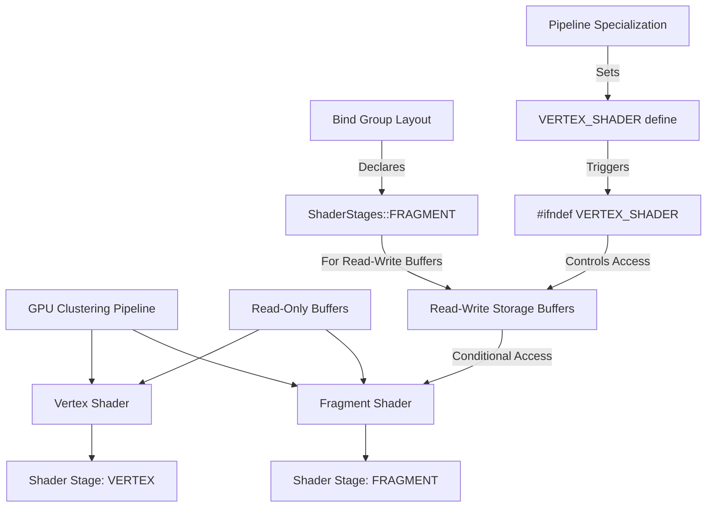

+++
title = "#23256 Don't let the clustering vertex shader see any read-write storage buffers."
date = "2026-03-08T00:00:00"
draft = false
template = "pull_request_page.html"
in_search_index = true

[taxonomies]
list_display = ["show"]

[extra]
current_language = "en"
available_languages = {"en" = { name = "English", url = "/pull_request/bevy/2026-03/pr-23256-en-20260308" }, "zh-cn" = { name = "中文", url = "/pull_request/bevy/2026-03/pr-23256-zh-cn-20260308" }}
labels = ["C-Bug", "A-Rendering"]
+++

# Title

## Basic Information
**Title**: Don't let the clustering vertex shader see any read-write storage buffers.
**PR Link**: https://github.com/bevyengine/bevy/pull/23256
**Author**: pcwalton
**Status**: MERGED
**Labels**: C-Bug, A-Rendering, S-Ready-For-Final-Review
**Created**: 2026-03-07T19:14:01Z
**Merged**: 2026-03-08T19:15:03Z
**Merged By**: mockersf

## Description Translation
The WebGPU spec forbids vertex shaders from having read-write storage buffers attached. As an extension, `wgpu` allows this on some hardware, but many mobile GPUs don't support it either. Because our bind group for GPU clustering rasterization specified `VERTEX_FRAGMENT` for all bindings, this was causing errors, even though we never actually used those read-write storage buffers in any vertex shaders.

This commit should fix the issue, by putting all read-write SSBO bindings behind `#ifdef`s and changing the `ShaderStages` for those bindings to `FRAGMENT`.

This should address the crashes in #23208 and #23216. I'm not sure if it'll address the incorrect lighting on certain devices in #23208, however; we may have to disable GPU clustering on those GPUs.

## The Story of This Pull Request

This PR addresses a WebGPU compliance issue affecting GPU clustering rasterization on certain hardware, particularly mobile GPUs. The problem stemmed from a mismatch between the WebGPU specification's restrictions and how Bevy's clustering shaders declared their buffer bindings.

The WebGPU specification explicitly forbids vertex shaders from accessing read-write storage buffers. While some desktop GPUs using the wgpu backend allow this via extensions, many mobile GPUs strictly enforce this restriction. In Bevy's GPU clustering implementation, the bind group layout was declaring all storage buffer bindings with `ShaderStages::VERTEX_FRAGMENT`, which meant the vertex shader technically had access to read-write storage buffers even though it never actually used them. This caused validation errors and crashes on mobile devices.

The solution takes a two-pronged approach: modifying the WGSL shader code to conditionally exclude read-write storage buffers from vertex shader compilation, and updating the Rust-side bind group layout definitions to correctly reflect the actual shader stage usage.

Looking at the WGSL changes in `cluster_raster.wgsl`, the developer wrapped all read-write storage buffer bindings with `#ifndef VERTEX_SHADER` preprocessor directives. This includes:
- The `index_lists` buffer at binding 1 (a read-write storage buffer)
- The `offsets_and_counts` buffers at bindings 7 and 8 (depending on whether it's a count or populate pass)

Additionally, the entire fragment shader entry point and associated helper functions are wrapped with the same conditional compilation guard. This ensures that when the shader is compiled for the vertex stage, these read-write buffers and fragment-specific code are completely omitted from the shader module.

On the Rust side in `gpu.rs`, the bind group layout entries for these read-write storage buffers are updated from `ShaderStages::VERTEX_FRAGMENT` to `ShaderStages::FRAGMENT`. This aligns the pipeline layout with the actual shader usage - the vertex shader doesn't need access to these buffers, so they shouldn't be declared as available to it.

The pipeline specialization logic also needed adjustment. The code now maintains separate shader definitions for vertex and fragment stages. The vertex shader gets an additional `VERTEX_SHADER` definition, which triggers the conditional compilation in the WGSL code. This approach allows the same WGSL source file to be compiled differently for vertex and fragment stages, which is a common pattern in graphics programming when dealing with stage-specific restrictions.

An important technical detail is that the fragment shader still needs access to these read-write buffers to perform its clustering work. The conditional compilation ensures that during fragment shader compilation (when `VERTEX_SHADER` is not defined), all the necessary buffer bindings and functions are available. The fragment shader uses these buffers to write object indices into cluster lists during the populate pass and to atomically increment counters during the count pass.

This fix is particularly relevant for mobile platforms where GPU vendors tend to be more conservative about API compliance. By strictly adhering to WebGPU's stage restrictions, Bevy avoids validation errors that would otherwise cause the pipeline creation to fail. However, as noted in the PR description, this may not completely solve all the issues reported in the linked tickets - some devices might still exhibit incorrect lighting, potentially requiring GPU clustering to be disabled entirely on problematic hardware.

The implementation demonstrates good practice in graphics API design: declare only the minimum required access for each shader stage, and use conditional compilation to handle stage-specific differences when sharing shader source files. This approach minimizes the surface area for validation errors while maintaining code reuse between shader stages.

## Visual Representation



## Key Files Changed

### 1. `crates/bevy_pbr/src/cluster/cluster_raster.wgsl`

This file contains the WGSL shader code for GPU clustering rasterization. The changes add conditional compilation guards around read-write storage buffer bindings and fragment-specific code.

**Key modifications:**
```wgsl
// Before (no conditional guards):
@group(0) @binding(1) var<storage, read_write> index_lists: ClusterableObjectIndexLists;

// After (with conditional guard):
@group(0) @binding(0) var<storage> z_slices: array<ClusterableObjectZSlice>;
#ifndef VERTEX_SHADER
@group(0) @binding(1) var<storage, read_write> index_lists: ClusterableObjectIndexLists;
#endif  // VERTEX_SHADER
```

```wgsl
// Fragment shader and related functions are now conditionally compiled:
#ifndef VERTEX_SHADER

@fragment
fn fragment_main(varyings: Varyings) -> @location(0) vec4<f32> {
    // ... fragment shader logic
}

#endif  // VERTEX_SHADER
```

### 2. `crates/bevy_pbr/src/cluster/gpu.rs`

This Rust file manages the GPU clustering pipeline setup. The changes update bind group layouts and shader specialization.

**Key modifications:**
```rust
// Before: Read-write buffers accessible to both vertex and fragment stages
binding_types::storage_buffer::<GpuClusterableObjectIndexListsStorage>(false)
    .build(1, ShaderStages::VERTEX_FRAGMENT),

// After: Limited to fragment stage only
binding_types::storage_buffer::<GpuClusterableObjectIndexListsStorage>(false)
    .build(1, ShaderStages::FRAGMENT),
```

```rust
// Pipeline specialization now uses different shader definitions per stage
let mut fragment_shader_defs = vec![];
if key.populate_pass {
    fragment_shader_defs.push(ShaderDefVal::from("POPULATE_PASS"));
} else {
    fragment_shader_defs.push(ShaderDefVal::from("COUNT_PASS"));
}

let mut vertex_shader_defs = fragment_shader_defs.clone();
vertex_shader_defs.push(ShaderDefVal::from("VERTEX_SHADER"));

// Used in vertex state:
vertex: VertexState {
    shader: self.shader.clone(),
    shader_defs: vertex_shader_defs,
    // ...
},

// Used in fragment state:  
fragment: Some(FragmentState {
    shader: self.shader.clone(),
    shader_defs: fragment_shader_defs,
    // ...
}),
```

## Further Reading

1. **WebGPU Specification** - The official WebGPU spec detailing shader stage restrictions: https://gpuweb.github.io/gpuweb/
2. **WGSL Specification** - WebGPU Shading Language specification for understanding shader compilation and conditional directives: https://www.w3.org/TR/WGSL/
3. **Bevy Rendering Documentation** - For understanding Bevy's rendering architecture and GPU clustering implementation
4. **wgpu Documentation** - Details on wgpu's API and extensions for storage buffer access across shader stages: https://docs.rs/wgpu/latest/wgpu/