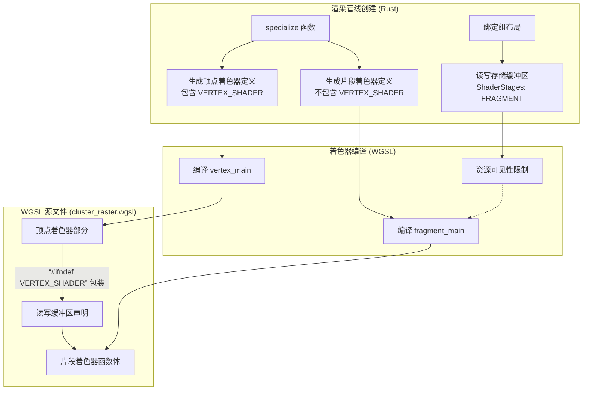

+++
title = "#23256 Don't let the clustering vertex shader see any read-write storage buffers."
date = "2026-03-08T00:00:00"
draft = false
template = "pull_request_page.html"
in_search_index = false

[extra]
current_language = "zh-cn"
available_languages = {"en" = { name = "English", url = "/pull_request/bevy/2026-03/pr-23256-en-20260308" }, "zh-cn" = { name = "中文", url = "/pull_request/bevy/2026-03/pr-23256-zh-cn-20260308" }}
labels = ["C-Bug", "A-Rendering"]
+++

# Title

## Basic Information
- **Title**: Don't let the clustering vertex shader see any read-write storage buffers.
- **PR Link**: https://github.com/bevyengine/bevy/pull/23256
- **Author**: pcwalton
- **Status**: MERGED
- **Labels**: C-Bug, A-Rendering, S-Ready-For-Final-Review
- **Created**: 2026-03-07T19:14:01Z
- **Merged**: 2026-03-08T19:15:03Z
- **Merged By**: mockersf

## Description Translation
WebGPU 规范禁止顶点着色器（vertex shader）附加读写存储缓冲区（read-write storage buffers）。作为扩展，`wgpu` 在某些硬件上允许此操作，但许多移动GPU也不支持。因为我们用于GPU集群光栅化（GPU clustering rasterization）的绑定组（bind group）为所有绑定指定了 `VERTEX_FRAGMENT`，这导致了错误，即使我们从未在任何顶点着色器中实际使用过那些读写存储缓冲区。

本次提交应该可以解决该问题，方法是将所有读写 SSBO 绑定放在 `#ifdef` 后面，并将这些绑定的 `ShaderStages` 改为 `FRAGMENT`。

这应该可以解决 issue #23208 和 #23216 中的崩溃。但我不确定这是否能解决 #23208 中在某些设备上出现的错误光照问题；我们可能必须在那些GPU上禁用GPU集群。

## The Story of This Pull Request

**问题与背景**
问题源于WebGPU图形API的规范限制。WebGPU明确禁止顶点着色器阶段（vertex stage）访问或绑定任何具有读写（read-write）属性的存储缓冲区（Storage Buffer）。这是规范层面的一致性要求。虽然Rust的`wgpu`库（作为WebGPU的实现/抽象层）在部分桌面硬件上将其作为扩展功能允许，但在移动GPU上，此限制通常被严格执行。在Bevy的GPU驱动集群光（GPU-driven clustered lighting）系统中，有一个用于执行光栅化（rasterization）以填充集群（cluster）数据的光栅管线。该管线的绑定组布局（bind group layout）将所有存储缓冲区的可见性（visibility）错误地标记为`ShaderStages::VERTEX_FRAGMENT`。这意味着这些缓冲区被声明为同时对顶点和片段着色器可见。尽管在实际的WGSL着色器代码中，那些具有读写属性的缓冲区（如 `index_lists` 和 `offsets_and_counts`）仅被片段着色器使用，顶点着色器并未访问它们，但这种过宽的可见性声明直接违反了WebGPU规范。在移动设备等严格遵循规范的平台上，这导致了管线创建失败或运行时崩溃（如issue #23208和#23216所报告的）。从本质上讲，这是一个API合规性（compliance）问题。

**解决方案与实现**
解决方案的思路很直接：确保顶点着色器“看不到”任何读写存储缓冲区。这需要从两个层面进行修改：1) 在Rust端，收紧绑定组的可见性范围；2) 在WGSL着色器代码中，使用条件编译（conditional compilation）排除顶点着色器对这些资源的声明。

首先，在 `crates/bevy_pbr/src/cluster/gpu.rs` 中，对于所有具有读写属性的存储缓冲区绑定（binding 1, 7, 8），将其 `ShaderStages` 从 `VERTEX_FRAGMENT` 改为 `FRAGMENT`。这一修改是核心，它从API声明层面确保了这些资源仅对片段着色器可见，从而符合WebGPU规范。

然而，仅这样做还不够。因为同一个WGSL着色器模块（`cluster_raster.wgsl`）同时包含顶点（`vertex_main`）和片段（`fragment_main`）入口点。如果模块在编译时包含了读写缓冲区的声明（例如 `var<storage, read_write> index_lists`），那么即使顶点着色器不引用它，整个模块的合规性在严格模式下可能仍会存在问题（或者某些编译器/驱动会报错）。因此，需要在WGSL代码中进行隔离。

解决方案是引入一个预处理器定义 `VERTEX_SHADER`。在 `gpu.rs` 的 `specialize` 函数中，现在会创建两组着色器定义（`shader_defs`）：一组用于顶点着色器（`vertex_shader_defs`），它除了原有的 `COUNT_PASS` 或 `POPULATE_PASS` 外，还额外添加了 `VERTEX_SHADER`；另一组用于片段着色器（`fragment_shader_defs`），则不包含 `VERTEX_SHADER`。这样，在编译顶点着色器时，`VERTEX_SHADER` 被定义；而在编译片段着色器时，它未被定义。

有了这个定义，就可以在 `cluster_raster.wgsl` 中使用 `#ifndef VERTEX_SHADER` 和 `#endif` 来包装所有读写存储缓冲区的声明（binding 1, 7, 8），以及整个 `fragment_main` 入口点函数和仅在片段着色器或“填充/计数”通道中使用的辅助函数（如 `allocate_index` 和 `increment_object_count`）。当 `VERTEX_SHADER` 被定义时（即编译顶点着色器阶段），这些代码块会被预处理器移除，确保顶点着色器所“见”的代码完全不涉及任何读写存储资源。这是一个干净且有效的隔离方法。

**技术细节与考量**
这种方法的优点在于它保持了单一着色器源文件的便利性，同时通过编译时条件实现了阶段间的资源隔离。它精确地解决了规范合规性问题，而没有改变任何实际的渲染逻辑或算法。性能上没有影响，因为只是移除了顶点着色器无法访问的声明。

一个值得注意的细节是，绑定组布局的修改（从 `VERTEX_FRAGMENT` 改为 `FRAGMENT`）本身可能就是以满足WebGPU规范，因为驱动程序/验证层主要检查的是绑定布局声明与实际资源使用的匹配性。但添加WGSL的条件编译提供了双重保障，并且可能对某些严格的编译器或未来的验证规则更友好。这是一种防御性编程（defensive programming）的体现。

作者在PR描述中也提到，此修复应能解决崩溃问题，但对于某些设备上可能存在的错误光照，可能需要更进一步，例如在那些GPU上完全回退到禁用GPU集群功能。这表明了移动GPU生态的碎片化以及图形API抽象层需要处理的复杂兼容性问题。

**影响与总结**
这个PR修复了一个关键的WebGPU合规性错误，该错误导致了在移动设备等平台上的渲染管线创建失败和崩溃。通过将读写存储缓冲区的可见性精确限定在片段着色器阶段，并使用条件编译在着色器代码中强化这一隔离，PR确保了Bevy的GPU集群系统能够在更广泛的硬件上稳定运行。这是一个典型的图形API兼容性修复案例，展示了在跨平台渲染引擎中管理着色器资源和阶段可见性的重要性。修复方案简洁、直接，且对现有渲染逻辑无副作用。

## Visual Representation



## Key Files Changed

1.  **`crates/bevy_pbr/src/cluster/cluster_raster.wgsl`**
    *   **变更目的**：防止顶点着色器编译时包含读写存储缓冲区的声明和相关代码，以满足WebGPU规范。
    *   **关键修改**：
        *   使用 `#ifndef VERTEX_SHADER` / `#endif` 包装了 `index_lists` (binding 1)、`offsets_and_counts` (binding 7) 和 `scratchpad_offsets_and_counts` (binding 8) 的声明。
        *   使用同样的条件编译指令包装了整个 `fragment_main` 函数及其调用的 `allocate_index`、`increment_object_count` 等仅在片段阶段使用的函数。
    *   **代码片段**:
        ```wgsl
        // 修改后（部分节选）:
        @group(0) @binding(0) var<storage> z_slices: array<ClusterableObjectZSlice>;
        #ifndef VERTEX_SHADER
        // The list of indices per cluster that we write to in the populate pass.
        @group(0) @binding(1) var<storage, read_write> index_lists: ClusterableObjectIndexLists;
        #endif  // VERTEX_SHADER

        ...

        #ifndef VERTEX_SHADER
        // Performs a fine-grained test to ensure that the object intersects a single
        // froxel and records the result.
        @fragment
        fn fragment_main(varyings: Varyings) -> @location(0) vec4<f32> {
          ...
        }
        #endif  // VERTEX_SHADER
        ```

2.  **`crates/bevy_pbr/src/cluster/gpu.rs`**
    *   **变更目的**：从绑定组布局声明层面，将读写存储缓冲区的可见性限制为仅片段着色器阶段 (`FRAGMENT`)，并确保着色器预处理器定义正确传递。
    *   **关键修改**：
        *   将绑定 1、7、8 的 `ShaderStages` 从 `VERTEX_FRAGMENT` 改为 `FRAGMENT`。
        *   在 `specialize` 方法中，分别为顶点和片段着色器创建独立的 `shader_defs` 列表，并为顶点着色器的定义添加 `VERTEX_SHADER`。
    *   **代码片段**:
        ```rust
        // 修改前（部分）:
        binding_types::storage_buffer::<GpuClusterableObjectIndexListsStorage>(false)
            .build(1, ShaderStages::VERTEX_FRAGMENT),

        // 修改后:
        binding_types::storage_buffer::<GpuClusterableObjectIndexListsStorage>(false)
            .build(1, ShaderStages::FRAGMENT),
        ```
        ```rust
        // specialize 方法中的修改:
        let mut fragment_shader_defs = vec![];
        if key.populate_pass {
            fragment_shader_defs.push(ShaderDefVal::from("POPULATE_PASS"));
        } else {
            fragment_shader_defs.push(ShaderDefVal::from("COUNT_PASS"));
        }

        let mut vertex_shader_defs = fragment_shader_defs.clone();
        vertex_shader_defs.push(ShaderDefVal::from("VERTEX_SHADER"));
        // 然后分别用于 vertex.shader_defs 和 fragment.shader_defs
        ```

## Further Reading
1.  **WebGPU Specification**: 关于着色器阶段（Shader Stages）和资源绑定（Resource Binding）的官方定义，特别是存储缓冲区（Storage Buffers）的访问限制。
    *   [WebGPU Specification - GPUProgrammableStage](https://www.w3.org/TR/webgpu/#dictdef-gpuprogrammablestage)
    *   [WebGPU Specification - GPUBindGroupLayoutEntry](https://www.w3.org/TR/webgpu/#dictdef-gpubindgrouplayoutentry)
2.  **wgpu Documentation**: Rust `wgpu` 库的文档，了解其如何映射和扩展WebGPU功能，以及处理平台差异。
    *   [wgpu docs on Buffer Usages](https://docs.rs/wgpu/latest/wgpu/struct.BufferDescriptor.html#structfield.usage)
3.  **Bevy GPU-Driven Clustering**: Bevy 引擎中关于GPU驱动集群光照系统的介绍和原理。
    *   [Bevy 官方文档 - PBR](https://bevyengine.org/learn/books/bevy-cheatbook/) （寻找PBR和光照相关章节）
    *   相关的源代码目录：`crates/bevy_pbr/src/cluster/`