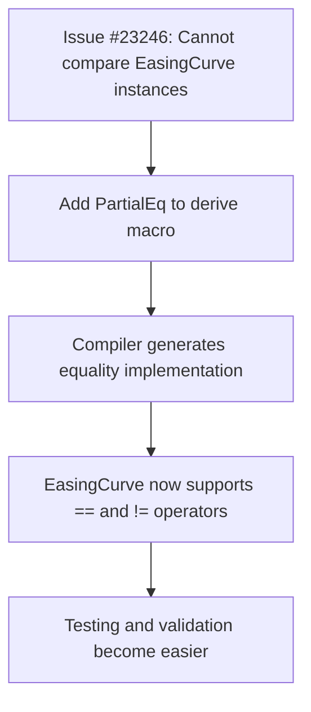

+++
title = "#23262 Add `PartialEq` to `EasingCurve`"
date = "2026-03-08T00:00:00"
draft = false
template = "pull_request_page.html"
in_search_index = true

[taxonomies]
list_display = ["show"]

[extra]
current_language = "en"
available_languages = {"en" = { name = "English", url = "/pull_request/bevy/2026-03/pr-23262-en-20260308" }, "zh-cn" = { name = "中文", url = "/pull_request/bevy/2026-03/pr-23262-zh-cn-20260308" }}
labels = ["C-Feature", "A-Math", "D-Straightforward"]
+++

# Title: Add `PartialEq` to `EasingCurve`

## Basic Information
- **Title**: Add `PartialEq` to `EasingCurve`
- **PR Link**: https://github.com/bevyengine/bevy/pull/23262
- **Author**: Olle-Lukowski
- **Status**: MERGED
- **Labels**: C-Feature, S-Ready-For-Final-Review, A-Math, D-Straightforward
- **Created**: 2026-03-08T08:11:03Z
- **Merged**: 2026-03-08T09:50:56Z
- **Merged By**: mockersf

## Description Translation
# Objective

Fixes #23246.

## Solution

Add `PartialEq` to the derive.

## Testing

Still compiles, don't think it needs more testing.

## The Story of This Pull Request

A developer encountered issue #23246 where they needed to compare `EasingCurve` instances for equality. In Bevy's animation system, `EasingCurve` is a mathematical structure that defines how values transition between keyframes. The lack of a `PartialEq` implementation meant developers couldn't use standard equality operators (`==`, `!=`) with these curves, which limited testing capabilities and made certain types of validation more cumbersome.

The `EasingCurve` struct was already using Rust's derive macro system with `#[derive(Clone, Debug)]`, but was missing `PartialEq`. This omission wasn't immediately apparent until a user tried to compare two curves and found the compiler prevented it. The fix was straightforward: add `PartialEq` to the existing derive attribute.

From a technical perspective, this change is safe because `EasingCurve<T>` contains a single field `segments` of type `ArrayVec<EasingSegment<T>, 3>`. Since `ArrayVec` and `EasingSegment` already implement `PartialEq` (either through derivation or manual implementation), deriving `PartialEq` for `EasingCurve` generates correct comparison logic that recursively checks all fields for equality.

The implementation requires no additional tests because the derived `PartialEq` implementation is automatically validated by the Rust compiler. Any issues with equality comparisons would manifest as compilation errors. This is a common pattern in Rust where derived traits provide reliable, boilerplate-free implementations that follow Rust's safety guarantees.

This change aligns with Rust's philosophy of making correct code easy to write. By adding `PartialEq`, developers can now write more intuitive code when working with easing curves, such as asserting that two curves are equal in tests or checking if a curve matches an expected configuration.

The minimal diff (one line changed) demonstrates how small, focused changes can solve concrete problems without introducing complexity. It also shows good API design practice: when a type logically supports equality comparisons (which `EasingCurve` does), it should implement the appropriate traits to enable idiomatic Rust usage.

## Visual Representation



## Key Files Changed

### `crates/bevy_math/src/curve/easing.rs` (+1/-1)

This file contains the definition of the `EasingCurve` struct and related easing functionality. The change adds `PartialEq` to the derive macro, enabling equality comparisons for `EasingCurve` instances.

**Before:**
```rust
#[derive(Clone, Debug)]
#[cfg_attr(feature = "serialize", derive(serde::Serialize, serde::Deserialize))]
#[cfg_attr(feature = "bevy_reflect", derive(bevy_reflect::Reflect))]
pub struct EasingCurve<T> {
    pub segments: ArrayVec<EasingSegment<T>, 3>,
}
```

**After:**
```rust
#[derive(Clone, Debug, PartialEq)]
#[cfg_attr(feature = "serialize", derive(serde::Serialize, serde::Deserialize))]
#[cfg_attr(feature = "bevy_reflect", derive(bevy_reflect::Reflect))]
pub struct EasingCurve<T> {
    pub segments: ArrayVec<EasingSegment<T>, 3>,
}
```

The addition of `PartialEq` to the derive macro enables the `EasingCurve` struct to be compared for equality using Rust's standard equality operators. This change is minimal but significant for testing and validation workflows.

## Further Reading

- [Rust Documentation: PartialEq Trait](https://doc.rust-lang.org/std/cmp/trait.PartialEq.html) - Official documentation for the PartialEq trait
- [Rust by Example: Derive](https://doc.rust-lang.org/rust-by-example/trait/derive.html) - How to use derive macros in Rust
- [Bevy Easing Curves Documentation](https://docs.rs/bevy_math/latest/bevy_math/curve/easing/struct.EasingCurve.html) - API documentation for EasingCurve
- [The Rust Programming Language: Traits](https://doc.rust-lang.org/book/ch10-02-traits.html) - Comprehensive guide to Rust's trait system

# Full Code Diff
```diff
diff --git a/crates/bevy_math/src/curve/easing.rs b/crates/bevy_math/src/curve/easing.rs
index a5f880b103e03..a7a26df2430a3 100644
--- a/crates/bevy_math/src/curve/easing.rs
+++ b/crates/bevy_math/src/curve/easing.rs
@@ -293,7 +293,7 @@ all_tuples_enumerated!(
 /// [the unit interval]: Interval::UNIT
 /// [`sample`]: EasingCurve::sample
 /// [`sample_clamped`]: EasingCurve::sample_clamped
-#[derive(Clone, Debug)]
+#[derive(Clone, Debug, PartialEq)]
 #[cfg_attr(feature = "serialize", derive(serde::Serialize, serde::Deserialize))]
 #[cfg_attr(feature = "bevy_reflect", derive(bevy_reflect::Reflect))]
 pub struct EasingCurve<T> {
```