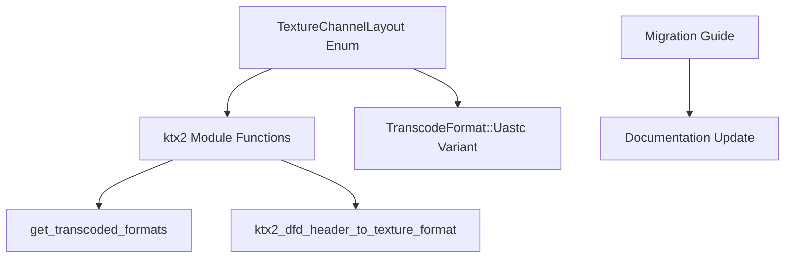

+++
title = "#23267 Rename `bevy_image::DataFormat` to `bevy_image::TextureChannelLayout`"
date = "2026-03-08T00:00:00"
draft = false
template = "pull_request_page.html"
in_search_index = true

[taxonomies]
list_display = ["show"]

[extra]
current_language = "en"
available_languages = {"en" = { name = "English", url = "/pull_request/bevy/2026-03/pr-23267-en-20260308" }, "zh-cn" = { name = "中文", url = "/pull_request/bevy/2026-03/pr-23267-zh-cn-20260308" }}
labels = ["D-Trivial", "A-Rendering", "M-Migration-Guide"]
+++

# Title

## Basic Information
- **Title**: Rename `bevy_image::DataFormat` to `bevy_image::TextureChannelLayout`
- **PR Link**: https://github.com/bevyengine/bevy/pull/23267
- **Author**: IQuick143
- **Status**: MERGED
- **Labels**: D-Trivial, A-Rendering, M-Migration-Guide, S-Needs-Review
- **Created**: 2026-03-08T17:14:11Z
- **Merged**: 2026-03-08T19:09:00Z
- **Merged By**: mockersf

## Description Translation
# Objective

- Fixes #23181

## The Story of This Pull Request

This PR addresses a straightforward naming issue in the Bevy game engine's image processing module. The problem was identified in GitHub issue #23181, which reported that the enum name `DataFormat` was too generic and ambiguous within the context of image processing. Specifically, this enum was used to describe texture channel layouts (how color channels are organized within a texture), but the name `DataFormat` didn't clearly convey that purpose.

The developer recognized that naming is important for code clarity and maintainability. When other engineers encounter `DataFormat` in the codebase, they might incorrectly assume it refers to file formats or data serialization formats rather than texture channel arrangements. This ambiguity could lead to confusion and potential misuse of the API.

The solution approach was simple and direct: rename the enum to `TextureChannelLayout`. This new name more accurately describes what the enum represents - the layout of color channels in a texture (like RGB, RGBA, or single-channel formats). The change required updating:
1. The enum definition itself
2. All references to `DataFormat` in the codebase
3. Documentation and migration guide

The implementation involved three files. First, in `crates/bevy_image/src/image.rs`, the enum was renamed from `DataFormat` to `TextureChannelLayout`. This change also required updating the `TranscodeFormat::Uastc` variant to use the new type name. Second, in `crates/bevy_image/src/ktx2.rs`, all imports and function signatures were updated to reference `TextureChannelLayout` instead of `DataFormat`. The pattern matching in the `get_transcoded_formats` function and the `ktx2_dfd_header_to_texture_format` function were updated to use the new enum variant names.

The technical insight here is that good naming reduces cognitive load for developers working with the codebase. When an API clearly communicates its purpose through its names, developers can understand and use it correctly with less documentation reading. This is particularly important in graphics programming where concepts like channel layouts have specific technical meanings.

The impact of this change is primarily on code clarity. Existing code using `DataFormat` will need to be updated, but since this is an internal API change (affecting the public API of the `bevy_image` crate), the migration path is straightforward: developers simply need to replace all references to `DataFormat` with `TextureChannelLayout`. The PR includes a migration guide to help with this transition.

From an engineering perspective, this change demonstrates good API design principles. Names should be specific enough to avoid ambiguity but general enough to cover their intended use cases. `TextureChannelLayout` hits this balance well - it's clear that it relates to textures and channel organization, but doesn't overspecify implementation details.

The rename also follows Rust naming conventions, where enum names use PascalCase and aim to be descriptive. The new name better aligns with other texture-related types in the Bevy codebase, creating a more consistent API surface.

## Visual Representation



## Key Files Changed

### `crates/bevy_image/src/image.rs`
**What changed**: Renamed the `DataFormat` enum to `TextureChannelLayout` and updated the `TranscodeFormat::Uastc` variant to use the new type.

```rust
// Before:
pub enum DataFormat {
    Rgb,
    Rgba,
    Rrr,
    Rrrg,
    Rg,
}

pub enum TranscodeFormat {
    Uastc(DataFormat),
}

// After:
pub enum TextureChannelLayout {
    Rgb,
    Rgba,
    Rrr,
    Rrrg,
    Rg,
}

pub enum TranscodeFormat {
    Uastc(TextureChannelLayout),
}
```

### `crates/bevy_image/src/ktx2.rs`
**What changed**: Updated imports, function signatures, and pattern matching to use the new `TextureChannelLayout` name and its variants.

```rust
// Import change:
// Before: use super::{CompressedImageFormats, DataFormat, Image, TextureError, TranscodeFormat};
// After: use super::{CompressedImageFormats, Image, TextureChannelLayout, TextureError, TranscodeFormat};

// Function signature change:
// Before: pub fn get_transcoded_formats(supported_compressed_formats: CompressedImageFormats, data_format: DataFormat, is_srgb: bool)
// After: pub fn get_transcoded_formats(supported_compressed_formats: CompressedImageFormats, data_format: TextureChannelLayout, is_srgb: bool)

// Pattern matching updates:
// Before: match data_format {
//     DataFormat::Rrr => { ... }
// After: match data_format {
//     TextureChannelLayout::Rrr => { ... }
```

### `release-content/migration-guides/dataformat_to_texturechannellayout.md`
**What changed**: Added a new migration guide document to help users transition from the old name to the new one.

```markdown
---
title: DataFormat renamed to TextureChannelLayout
pull_requests: [23267]
---

`bevy_image::DataFormat` is now `bevy_image::TextureChannelLayout`. Replace all references and imports.
```

## Further Reading

1. [Rust API Guidelines - Naming](https://rust-lang.github.io/api-guidelines/naming.html)
2. [Bevy Engine Documentation](https://docs.rs/bevy/latest/bevy/)
3. [KTX2 Texture Format Specification](https://github.khronos.org/KTX-Specification/)
4. [UASTC Texture Specification](https://github.com/BinomialLLC/basis_universal/wiki/UASTC-Texture-Specification)

# Full Code Diff
```diff
diff --git a/crates/bevy_image/src/image.rs b/crates/bevy_image/src/image.rs
index e7964bc82814c..1199467de6041 100644
--- a/crates/bevy_image/src/image.rs
+++ b/crates/bevy_image/src/image.rs
@@ -2000,7 +2000,7 @@ impl Image {
 ///
 /// [UASTC]: https://github.com/BinomialLLC/basis_universal/wiki/UASTC-Texture-Specification/b624c07ad3c659e7b0f0badcb36e9a6b8820a99d
 #[derive(Clone, Copy, Debug)]
-pub enum DataFormat {
+pub enum TextureChannelLayout {
     /// 3-color
     Rgb,
     /// 4-color
@@ -2019,7 +2019,7 @@ pub enum TranscodeFormat {
     /// Has to be transcoded from a compressed ETC1S texture.
     Etc1s,
     /// Has to be transcoded from a compressed UASTC texture.
-    Uastc(DataFormat),
+    Uastc(TextureChannelLayout),
     /// Has to be transcoded from `R8UnormSrgb` to `R8Unorm` for use with `wgpu`.
     R8UnormSrgb,
     /// Has to be transcoded from `Rg8UnormSrgb` to `R8G8Unorm` for use with `wgpu`.
diff --git a/crates/bevy_image/src/ktx2.rs b/crates/bevy_image/src/ktx2.rs
index 92455ef0117a6..7491c5446851c 100644
--- a/crates/bevy_image/src/ktx2.rs
+++ b/crates/bevy_image/src/ktx2.rs
@@ -18,7 +18,7 @@ use wgpu_types::{
     TextureViewDimension,
 };
 
-use super::{CompressedImageFormats, DataFormat, Image, TextureError, TranscodeFormat};
+use super::{CompressedImageFormats, Image, TextureChannelLayout, TextureError, TranscodeFormat};
 
 /// Converts KTX2 bytes to a bevy [`Image`] using the given compressed format support.
 ///
@@ -305,15 +305,15 @@ pub fn ktx2_buffer_to_image(
 }
 
 /// Determines an appropriate wgpu-compatible format based on compressed format support, and a
-/// basis universal [`DataFormat`].
+/// basis universal [`TextureChannelLayout`].
 #[cfg(feature = "basis-universal")]
 pub fn get_transcoded_formats(
     supported_compressed_formats: CompressedImageFormats,
-    data_format: DataFormat,
+    data_format: TextureChannelLayout,
     is_srgb: bool,
 ) -> (TranscoderBlockFormat, TextureFormat) {
     match data_format {
-        DataFormat::Rrr => {
+        TextureChannelLayout::Rrr => {
             if supported_compressed_formats.contains(CompressedImageFormats::BC) {
                 (TranscoderBlockFormat::BC4, TextureFormat::Bc4RUnorm)
             } else if supported_compressed_formats.contains(CompressedImageFormats::ETC2) {
@@ -325,7 +325,7 @@ pub fn get_transcoded_formats(
                 (TranscoderBlockFormat::RGBA32, TextureFormat::R8Unorm)
             }
         }
-        DataFormat::Rrrg | DataFormat::Rg => {
+        TextureChannelLayout::Rrrg | TextureChannelLayout::Rg => {
             if supported_compressed_formats.contains(CompressedImageFormats::BC) {
                 (TranscoderBlockFormat::BC5, TextureFormat::Bc5RgUnorm)
             } else if supported_compressed_formats.contains(CompressedImageFormats::ETC2) {
@@ -339,7 +339,7 @@ pub fn get_transcoded_formats(
         }
         // NOTE: Rgba16Float should be transcoded to BC6H/ASTC_HDR. Neither are supported by
         // basis-universal, nor is ASTC_HDR supported by wgpu
-        DataFormat::Rgb | DataFormat::Rgba => {
+        TextureChannelLayout::Rgb | TextureChannelLayout::Rgba => {
             // NOTE: UASTC can be losslessly transcoded to ASTC4x4 and ASTC uses the same
             // space as BC7 (128-bits per 4x4 texel block) so prefer ASTC over BC for
             // transcoding speed and quality.
@@ -1178,11 +1178,11 @@ pub fn ktx2_dfd_header_to_texture_format(
         Some(ColorModel::UASTC) => {
             return Err(TextureError::FormatRequiresTranscodingError(
                 TranscodeFormat::Uastc(match sample_information[0].channel_type {
-                    0 => DataFormat::Rgb,
-                    3 => DataFormat::Rgba,
-                    4 => DataFormat::Rrr,
-                    5 => DataFormat::Rrrg,
-                    6 => DataFormat::Rg,
+                    0 => TextureChannelLayout::Rgb,
+                    3 => TextureChannelLayout::Rgba,
+                    4 => TextureChannelLayout::Rrr,
+                    5 => TextureChannelLayout::Rrrg,
+                    6 => TextureChannelLayout::Rg,
                     channel_type => {
                         return Err(TextureError::UnsupportedTextureFormat(format!(
                             "Invalid KTX2 UASTC channel type: {channel_type}",
diff --git a/release-content/migration-guides/dataformat_to_texturechannellayout.md b/release-content/migration-guides/dataformat_to_texturechannellayout.md
new file mode 100644
index 0000000000000..6d7f94c7f1520
--- /dev/null
+++ b/release-content/migration-guides/dataformat_to_texturechannellayout.md
@@ -0,0 +1,6 @@
+---
+title: DataFormat renamed to TextureChannelLayout
+pull_requests: [23267]
+---
+
+`bevy_image::DataFormat` is now `bevy_image::TextureChannelLayout`. Replace all references and imports.
```