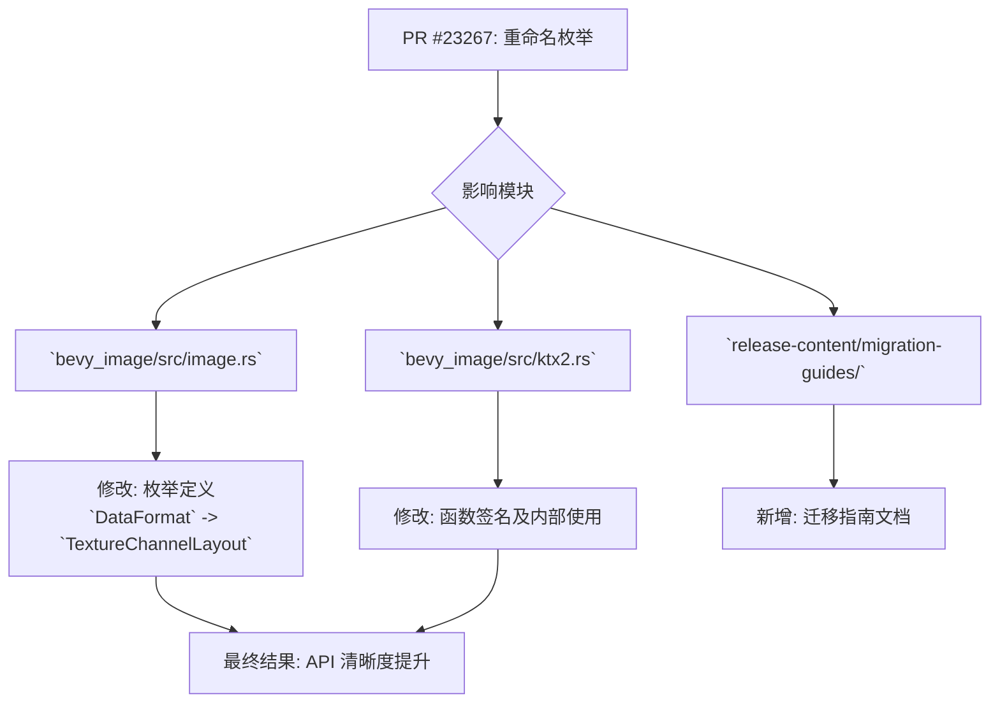

+++
title = "#23267 Rename `bevy_image::DataFormat` to `bevy_image::TextureChannelLayout`"
date = "2026-03-08T00:00:00"
draft = false
template = "pull_request_page.html"
in_search_index = false

[extra]
current_language = "zh-cn"
available_languages = {"en" = { name = "English", url = "/pull_request/bevy/2026-03/pr-23267-en-20260308" }, "zh-cn" = { name = "中文", url = "/pull_request/bevy/2026-03/pr-23267-zh-cn-20260308" }}
labels = ["D-Trivial", "A-Rendering", "M-Migration-Guide"]
+++

# Title
Rename `bevy_image::DataFormat` to `bevy_image::TextureChannelLayout`

## Basic Information
- **Title**: Rename `bevy_image::DataFormat` to `bevy_image::TextureChannelLayout`
- **PR Link**: https://github.com/bevyengine/bevy/pull/23267
- **Author**: IQuick143
- **Status**: MERGED
- **Labels**: D-Trivial, A-Rendering, M-Migration-Guide, S-Needs-Review
- **Created**: 2026-03-08T17:14:11Z
- **Merged**: 2026-03-08T19:09:00Z
- **Merged By**: mockersf

## Description Translation
# 目标 (Objective)
- 修复 issue #23181

## The Story of This Pull Request

这个 PR 始于一个命名问题。在 Bevy 的 `bevy_image` 模块中，有一个枚举类型名为 `DataFormat`。它的作用是定义当从压缩的 UASTC (Universal ASTC) 纹理格式进行解码时，其内部颜色通道是如何排列的。具体来说，它描述的是纹理数据的通道布局，例如是 `Rgb`（三色通道）、`Rgba`（四色通道）、`Rrr`（单通道，用于标量数据）还是 `Rg`（双通道）等。

然而，`DataFormat` 这个名称存在歧义，不够精确。在计算机图形学中，“Data Format”是一个非常宽泛的术语，可以指代任何类型的数据存储方式（如字节序、数据类型、压缩算法等）。在 Bevy 的上下文中，这个枚举特指纹理的**通道布局 (channel layout)**。一个模糊的名称会增加新开发者理解代码的认知负担，也可能导致维护者在其他上下文中错误地复用这个类型。

因此，issue #23181 被提出，旨在将这个枚举重命名为一个更具描述性的名字。PR #23267 就是对这个问题的直接回应。

解决方案非常直接：将 `bevy_image::DataFormat` 枚举及其在所有相关代码中的引用，统一重命名为 `bevy_image::TextureChannelLayout`。新名称清晰地表明了其职责：定义纹理的通道布局。这是一个典型的代码重构（refactoring），旨在提高代码的表达力（expressiveness）和可维护性（maintainability），而不改变任何功能逻辑。

实施过程涉及两个核心代码文件的修改。首先，在 `image.rs` 中，枚举定义本身被重命名。同时，另一个枚举 `TranscodeFormat` 中包含的一个变体 `Uastc(DataFormat)` 也必须更新其内部类型引用。其次，在 `ktx2.rs` 中，所有导入、函数参数类型和匹配（`match`）语句中的 `DataFormat` 都被替换为 `TextureChannelLayout`。例如，函数 `get_transcoded_formats` 的参数从 `data_format: DataFormat` 改为了 `data_format: TextureChannelLayout`，使其意图更加明确。

由于这是一个破坏性变更（breaking change），任何在项目外部代码中引用了 `bevy_image::DataFormat` 的用户，在升级 Bevy 版本后都会遇到编译错误。为了帮助用户顺利迁移，这个 PR 遵循了 Bevy 的良好实践，同时创建了一个迁移指南（migration guide）。这个指南是一个简单的 Markdown 文件，它会被集成到 Bevy 的官方文档中，明确告知用户需要将所有的引用和导入从 `DataFormat` 更新为 `TextureChannelLayout`。

总的来说，这个 PR 是一个小而精的改进。它通过一次精准的重命名，提升了特定模块 API 的清晰度。这种改进虽然微小，但对于保持大型代码库的长期健康至关重要。它减少了歧义，使代码的“言外之意”（即类型名所传达的意图）与其实际功能完全一致，从而让其他开发者更容易理解和正确使用这个 API。

## Visual Representation



## Key Files Changed

**1. `crates/bevy_image/src/image.rs` (+2/-2)**
*   **修改说明**: 这是重命名的核心。直接修改了公共枚举类型的定义及其在一个相关枚举中的使用。
*   **代码变更**:
    ```rust
    // File: crates/bevy_image/src/image.rs
    // Before:
    pub enum DataFormat {
        Rgb,
        Rgba,
        Rrr,
        Rrrg,
        Rg,
    }
    pub enum TranscodeFormat {
        Uastc(DataFormat), // 引用旧类型
    }

    // After:
    pub enum TextureChannelLayout { // 枚举重命名
        Rgb,
        Rgba,
        Rrr,
        Rrrg,
        Rg,
    }
    pub enum TranscodeFormat {
        Uastc(TextureChannelLayout), // 更新为引用新类型
    }
    ```

**2. `crates/bevy_image/src/ktx2.rs` (+11/-11)**
*   **修改说明**: 更新了 `ktx2` 模块以使用新的类型名。这包括导入语句、函数参数和模式匹配，确保了内部逻辑与新的 API 名称保持一致。
*   **代码变更**:
    ```rust
    // File: crates/bevy_image/src/ktx2.rs
    // Before (导入):
    use super::{CompressedImageFormats, DataFormat, Image, TextureError, TranscodeFormat};
    // Before (函数签名):
    pub fn get_transcoded_formats(
        supported_compressed_formats: CompressedImageFormats,
        data_format: DataFormat, // 参数类型为 DataFormat
        is_srgb: bool,
    ) -> (TranscoderBlockFormat, TextureFormat)
    // Before (匹配模式):
    match data_format {
        DataFormat::Rrr => { ... },
        // ... 其他变体
    }

    // After (导入):
    use super::{CompressedImageFormats, Image, TextureChannelLayout, TextureError, TranscodeFormat};
    // After (函数签名):
    pub fn get_transcoded_formats(
        supported_compressed_formats: CompressedImageFormats,
        data_format: TextureChannelLayout, // 参数类型更新为 TextureChannelLayout
        is_srgb: bool,
    ) -> (TranscoderBlockFormat, TextureFormat)
    // After (匹配模式):
    match data_format {
        TextureChannelLayout::Rrr => { ... },
        // ... 其他变体
    }
    ```

**3. `release-content/migration-guides/dataformat_to_texturechannellayout.md` (+6/-0)**
*   **修改说明**: 新增了一个迁移指南文档。这是对用户的重要支持，明确告知了此项破坏性变更以及如何修复。
*   **代码/内容**:
    ```markdown
    ---
    title: DataFormat renamed to TextureChannelLayout
    pull_requests: [23267]
    ---

    `bevy_image::DataFormat` is now `bevy_image::TextureChannelLayout`. Replace all references and imports.
    ```

## Further Reading
1.  **Bevy 官方迁移指南**: 了解 Bevy 如何处理其他破坏性变更的最佳实践。
2.  **《重构：改善既有代码的设计》** (Refactoring: Improving the Design of Existing Code by Martin Fowler): 本书详细阐述了“重命名”等重构手法的价值和操作步骤。
3.  **UASTC 纹理规范**: 关于这个 PR 中涉及的 `Uastc(TextureChannelLayout)` 变体背后的压缩纹理格式的详细资料。